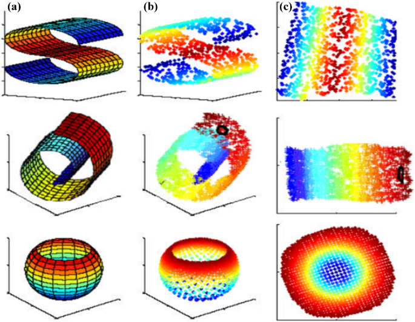

## Вопросы понижения размерности данных: от классических алгоритмов, до современных вариантов на базе ГО.
*Поглазов Никита 2384*

---

## Cодержание

1. Введение
2. Мотивация
3. Методы понижения размерности: Обзор и Классификация
4. Principal Component Analysis (*PCA*)
5. Linear Discriminant Analysis (*LDA*)
6. AutoEncoders
7. Сравнительный анализ методов
8. Заключение
9. Список литературы

---

## Введение

Высокая размерность данных ведет к "проклятию размерности", что усложняет анализ и увеличивает вычислительные затраты. 
Методы понижения размерности, помогают упростить данные, выделяя ключевые признаки и снижая шум. 
В докладе рассматриваются их основы, преимущества и примеры использования.

---

## Мотивация

Что такое "проклятие размерности"?