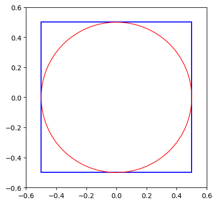
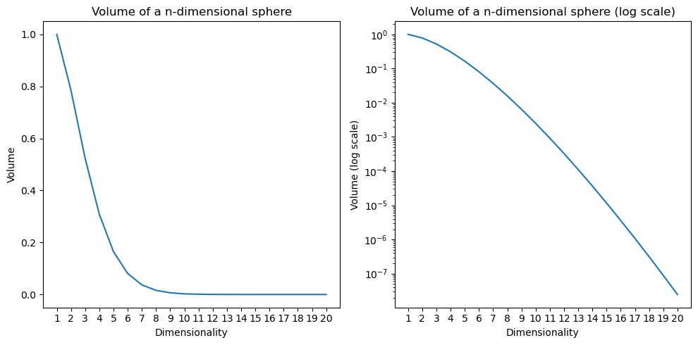

# Вопросы понижения размерности данных: от классических алгоритмов, до современных вариантов на базе ГО.
*Поглазов Никита 2384*

ЛЭТИ 2024 Семинар по ИИ

## Cодержание

1. Введение
2. Мотивация
3. Методы понижения размерности: Обзор и Классификация
4. Principal Component Analysis (*PCA*)
5. Linear Discriminant Analysis (*LDA*)
6. *AutoEncoders*
7. Сравнительный анализ методов
8. Заключение
9. Список литературы

## Введение

В современном мире часто приходится сталкиваться с задачей обработки данных высокой размерности, будь то изображения, текстовые данные или сложные наборы числовых признаков. Однако избыточность данных и так называемое "проклятие размерности" могут значительно ухудшать производительность моделей, затруднять интерпретацию результатов и увеличивать вычислительные затраты.

В свою очередь, методы понижения размерности помогают решать эти проблемы, позволяя выявить наиболее важные признаки, отбрасывая шум и оптимизируя процесс обучения моделей. Существуют как классические методы понижения размерности, такие как анализ главных компонент (PCA) и линейный дискриминантный анализ (LDA), так и современные подходы на основе глубокого обучения, такие как AutoEncoders. Каждый из этих методов имеет свои сильные и слабые стороны, различную применимость в зависимости от типа задачи и структуры данных.

Цель данного доклада — рассмотреть особенности этих методов, их теоретическое обоснование, основные области применения, а также плюсы и минусы каждого подхода.

## Мотивация

Что такое "проклятие размерности"?

Давайте попробуем интуитивно разобраться в этом явлении. Для этого проведем небольшой эксперимент с многомерными пространствами. 

Возьмем квадрат со сторонами 1, в который вписан круг.

$S_{square}=1$

$S_{circle}=\pi*(0.5)^2=\frac{\pi}{4}\approx0.79$

То есть круг занимет $\approx79\%$ площади квадрата.

Обобщим задачу до гиперсферы, вписанной в гиперкуб в n-мерном пространстве. Очевидно, что объем гиперкуба остается равным $1$. Но что станет с объемом вписанной гиперсферы? Он увеличится, уменьшится или останется неизменным?

Опытные математики знают ответ на этот вопрос, но его тяжело осознать, ведь, как исторически сложилось, мы живем в трехмерном пространстве.

Объем n-мерной гиперсферы задается следующим соотношением:

$$V_n=C_nR^n$$

$$C_n=\frac{\pi^{n/2}}{\Gamma(\frac{n}{2}+1)}$$

Как видно, в знаменателе стоит Гамма функция, которая растет быстрее экспоненциальной функции в числителе. То есть $\lim_{n\to\infin}V_n=0$.

Тем временем, диагональ гиперкуба будет равна
$$
\sqrt{\sum_{i=1}^n1^2} = \sqrt{n}
$$
То есть она будет постоянно увеличиваться и все больше объема будет приходиться на углы куба.

Если данные будут находиться в $[-\frac{1}{2}, \frac{1}{2}]^n$, то потребуется все больше и больше наблюдений, чтобы с заданной точностью описать вписанную (или, что хуже, произвольную) гиперсферу.

Также интересно следующее явление. Рассмотрим манхэттенские расстояния между двумя точками в n-мерном пространстве.

$$
d(x^{(i)}, x^{(j)})=||x^{(i)}- x^{(j)}||_1=\sum_{k=1}^n|x^{(i)}- x^{(j)}|
$$

Согласно закону больших чисел

$$
\lim_{n\to\infin}d(x^{(i)}, x^{(j)})=\mu
$$

Где $\mu$ - среднее расстояние между всеми наблюдениями. 

Таким образом, точки в пространствах большой размерности все более равноудалены друг от друга. Это серьезно влияет на производительность метрических моделей, таких как kNN.

## Список литературы

http://www.machinelearning.ru/wiki/index.php?title=%D0%9F%D1%80%D0%BE%D0%BA%D0%BB%D1%8F%D1%82%D0%B8%D0%B5_%D1%80%D0%B0%D0%B7%D0%BC%D0%B5%D1%80%D0%BD%D0%BE%D1%81%D1%82%D0%B8

https://habr.com/ru/companies/wunderfund/articles/748044/

https://ru.wikipedia.org/wiki/%D0%93%D0%B8%D0%BF%D0%B5%D1%80%D1%81%D1%84%D0%B5%D1%80%D0%B0