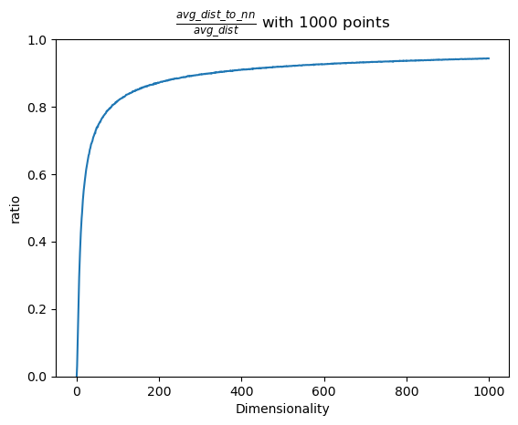

# Вопросы понижения размерности данных: от классических алгоритмов, до современных вариантов на базе ГО.
*Поглазов Никита 2384*

ЛЭТИ 2024 Семинар по ИИ

## Содержание

1. [Введение](#введение)
2. [Мотивация](#мотивация)
3. [Методы понижения размерности: Обзор и Классификация](#методы-понижения-размерности-обзор-и-классификация)
4. [Principal Component Analysis (*PCA*)](#principal-component-analysis-pca)
5. [Linear Discriminant Analysis (*LDA*)](#linear-discriminant-analysis-lda)
6. [*AutoEncoders*](#autoencoders)
7. [Сравнительный анализ методов](#сравнительный-анализ-методов)
8. [Заключение](#заключение)
9. [Список литературы](#список-литературы)

## Введение

В современном мире часто приходится сталкиваться с задачей обработки данных высокой размерности, будь то изображения, текстовые данные или сложные наборы числовых признаков. Однако избыточность данных и так называемое "проклятие размерности" могут значительно ухудшать производительность моделей, затруднять интерпретацию результатов и увеличивать вычислительные затраты.

В свою очередь, методы понижения размерности помогают решать эти проблемы, позволяя выявить наиболее важные признаки, отбрасывая шум и оптимизируя процесс обучения моделей. Существуют как классические методы понижения размерности, такие как анализ главных компонент (PCA) и линейный дискриминантный анализ (LDA), так и современные подходы на основе глубокого обучения, такие как AutoEncoders. Каждый из этих методов имеет свои сильные и слабые стороны, различную применимость в зависимости от типа задачи и структуры данных.

Цель данного доклада — рассмотреть особенности этих методов, их теоретическое обоснование, основные области применения, а также плюсы и минусы каждого подхода.

## Мотивация

### Влияние проклятия размерности на распределение данных

Что такое "проклятие размерности"?

Давайте попробуем разобраться в этом явлении. Для этого проведем небольшой эксперимент с многомерными пространствами. 

Возьмем квадрат со сторонами 1, в который вписан круг.

$S_{square}=1$

$S_{circle}=\pi*(0.5)^2=\frac{\pi}{4}\approx0.79$

То есть круг занимает $\approx79\%$ площади квадрата.

Обобщим задачу до гиперсферы, вписанной в гиперкуб в n-мерном пространстве. Очевидно, что объем гиперкуба остается равным $1$. Но что станет с объемом вписанной гиперсферы? Он увеличится, уменьшится или останется неизменным?

Опытные математики знают ответ на этот вопрос, но его тяжело осознать, ведь, как исторически сложилось, мы живем в трехмерном пространстве.

Объем n-мерной гиперсферы задается следующим соотношением:

$$V_n=C_nR^n$$

$$C_n=\frac{\pi^{n/2}}{\Gamma(\frac{n}{2}+1)}$$

Как видно, в знаменателе стоит Гамма функция, которая растет быстрее экспоненциальной функции в числителе. То есть $\lim_{n\to\infin}V_n=0$.

Тем временем, диагональ гиперкуба будет равна
$$
\sqrt{\sum_{i=1}^n1^2} = \sqrt{n}
$$
То есть она будет постоянно увеличиваться и все больше объема будет приходиться на углы куба.

Если данные будут находиться в $[-\frac{1}{2}, \frac{1}{2}]^n$, то потребуется все больше и больше наблюдений, чтобы с заданной точностью описать вписанную (или, что хуже, произвольную) гиперсферу.

### Влияние на метрические модели

Рассмотрим манхеттенские ($L_1$) расстояния между двумя точками в n-мерном пространстве.

$$
d(x^{(i)}, x^{(j)})=||x^{(i)}- x^{(j)}||_1=\sum_{k=1}^n|x^{(i)}- x^{(j)}|
$$

Согласно закону больших чисел

$$
\lim_{n\to\infin}\frac{d(x^{(i)}, x^{(j)})}n=\mu
$$

Где $\mu$ - среднее расстояние между всеми наблюдениями. 

Также это будет сохраняться и для любой другой $L_p$-нормы.

На графике изображено отношение среднего расстояния между ближайшим соседом с средним расстоянием между двумя точками. В эксперименте генерируется 1000 точек $\xi\sim U([0, 1)^n)$. Расстояние евклидово.

Видно, что с увеличением размерности отношение стремится к 1, т.е. среднее расстояние между ближайшими соседями стремится к среднему расстоянию между двумя точками.

Таким образом, при увеличении размерности, одно и то же количество точек будет находиться в пространстве на все более равном расстоянии. Это серьезно влияет на производительность метрических моделей, таких как kNN и k-Means.

### Влияние на линейные модели

Аналитическое решение задачи линейной регрессии с оптимизацией MSE:

$$
(X^TX)\hat{\beta}=X^Ty
$$
Где $X$ - наблюдения, $y$ - целевые значения, $\hat{\beta}$ - оптимизируемые веса.

При центрировании данных матрица ковариации равна:

$$
\mathrm{Cov}(X)=\frac{1}{k-1}X^TX
$$

Где $k$ - число наблюдений.

Чем более скоррелированны признаки в наблюдениях, тем более близкой к вырожденной становится матрица ковариации, что влечет за собой нестабильные значения весов и переобучение модели. А с ростом размерности увеличивается и вероятность мультиколлинеарности.

### Влияние на "деревянные" модели

Проклятие размерности оказывает сильное влияние на процесс построения дерева решений (*Decision Tree*), ведь с ростом размерности для каждого разбиения становится сложно найти оптимальную точку разделения, так как требуется анализировать экспоненциально больше комбинаций.

Из-за разреженности данных, если большинство признаков нерелевантны, алгоритм может сделать разбиение по случайным направлениям, ухудшая обобщающую способность модели.

Деревья решений известны своей способностью к переобучению, что является еще большей проблемой при высоких размерностях.

По тем же причинам алгоритмы бустинга (AdaBoost и Gradient Boosting в частности) не очень эффективны при больших размерностях, т.к. используют в качестве базовых моделей "слабые" классификаторы (*weak learners*), например решающие пни (деревья глубины 1), которые сами по себе чувствительны к проклятию размерности по вышеописанным причинам.

С другой стороны, случайные леса (*Random Forest*) используют RSM (*Random Subspace Method*) - метод случайного выбора подмножества признаков для каждого дерева, в сочетании с бэггингом для обучения отдельных деревьев, что снижает размерность пространства для обучения. Проблема может возникнуть, в том, случае, если много признаков не коррелируют с целевой переменной, что приведет к увеличению числа моделей в ансамбле.

### Влияние на глубокие нейронные сети

Влияние "проклятия размерности" на глубокие нейронные сети (*DNN*) существенно зависит от их архитектуры, активационных функций и глубины. Несмотря на то, что DNN часто считаются устойчивыми к данным высокой размерности, это не означает, что они полностью свободны от проблем, вызванных разреженностью и избыточностью данных.

Некоторые архитектуры глубоких нейронных сетей, такие как сверточные нейронные сети (*CNN*), рекуррентные нейронные сети (RNN) и трансформеры, имеют механизмы, которые помогают справляться с высокой размерностью данных:

CNN эффективно работают с высокоразмерными входными данными (например, изображениями), выделяя локальные взаимосвязи с помощью сверточных фильтров. Вместо обработки каждого признака по отдельности они сворачивают соседние значения, уменьшая размерность в скрытых слоях.

RNN и LSTM (*Long short-term memory*) справляются с последовательными данными (например, текстами или временными рядами) благодаря способности моделировать временные зависимости. Они эффективно используют архитектуру, где высокая размерность сосредоточена на временных характеристиках, а не на пространственном распределении.

Трансформеры используют механизм внимания (*attention*), позволяющий моделировать только значимые зависимости между признаками. Это делает их особенно устойчивыми при работе с высокоразмерными пространствами, так как они изолируют релевантные признаки, игнорируя нерелевантные.

Несмотря на описанные преимущества, глубокие нейронные сети могут сталкиваться с рядом сложностей. Наличие нерелевантных признаков увеличивает риск запоминания шума, особенно для табличных данных и высокая размерность усложняет поиск глобального минимума в функции потерь градиентными методами.

### Общее влияние

Основная проблема высокой размерности для моделей машинного обучения с учителем заключается в кратном увеличении времени обучения (особенно сильно это затрагивает DNN).

Большое количество признаков мешает интерпретируемости табличных данных, что сильно затрудняет анализ для задач бизнеса.

Также с увеличением числа признаков, растет вероятность того, что часть из них не будет содержать полезной для обучения информации (что особенно влияет на "деревянные" модели). Модель может начать «учиться» на шуме, а не на реальных зависимостях, что приводит к переобучению.

### Выводы

Проклятие размерности оказывает фундаментальное влияние на большинство алгоритмов машинного обучения, требуя либо снижения размерности данных, либо адаптации моделей под многомерные данные.

Теперь, осознав проблематику, можем перейти к одному из способов ее решения: алгоритмам сжатия данных.

## Методы понижения размерности: Обзор и Классификация

Существуют два ключевых подхода к понижению размерности: **отбор признаков** и **преобразование признаков**. В первом случае методы выбирают подмножество исходных переменных, которые лучше всего объясняют данные. Во втором — исходное пространство преобразуется в пространство меньшей размерности с сохранением наиболее значимых свойств.

В этом разделе обзорно рассмотрим большую часть алгоритмов понижения размерности. В следующем разделе максимально подробно рассмотрим самые популярные и часто используемые из них.

### Линейные методы

Линейные методы опираются на предположение, что данные можно эффективно описать в пространстве меньшей размерности при помощи линейных комбинаций исходных признаков.

#### Метод главных компонент (*Principal Component Analysis, PCA*)

PCA — один из наиболее известных методов преобразования признаков. Цель метода заключается в нахождении ортогональных векторов, называемых главными компонентами, которые объясняют максимальную дисперсию в данных.

##### Пример применения

PCA часто используется для визуализации высокоразмерных данных. Например, в геномике метод позволяет уменьшить размерность набора данных, содержащего экспрессию тысяч генов, для последующей кластеризации образцов.

#### Линейный дискриминантный анализ (*Linear Discriminant Analysis, LDA*)

LDA – это метод, который сочетает снижение размерности с задачей классификации. В отличие от PCA, который сосредоточен на сохранении максимальной дисперсии в данных, LDA оптимизирует разбиение между заранее определенными классами. Этот метод ищет проекции, которые максимизируют разницу между классами, одновременно минимизируя разброс внутри каждого класса.

Основная идея LDA заключается в оптимизации двух матриц: межклассовой дисперсии (между центроидами классов) и внутриклассовой дисперсии (распределения точек внутри каждого класса). Итоговое проецирование основывается на нахождении направлений, которые лучше всего разделяют данные по классам.

##### Пример применения
LDA находит широкое применение в задачах, где важна не только визуализация данных, но и разделение классов. Например, в биометрии он используется для обработки изображений лиц. В задаче распознавания лиц LDA помогает выделить направления, где лица из разных классов (разных людей) лучше всего разделяются, сохраняя различия, важные для классификации.

#### Сингулярное разложение (*Singular Value Decomposition, SVD*)

SVD — линейный метод, лежащий в основе многих алгоритмов понижения размерности, включая PCA. Сингулярное разложение позволяет представить матрицу данных $X$ как произведение трех матриц:

$$
X=U\Sigma V^T
$$

Где $U$ и $V$ — ортогональные матрицы, а $\Sigma$ содержит сингулярные значения.

##### Пример применения:

SVD используется в алгоритме Latent Semantic Analysis (LSA) для анализа текстов, где матрица документ-термин (описывает частоту терминов, которые встречаются в коллекции документов) преобразуется в пространство скрытых семантических отношений.

#### Каноническое корреляционное преобразование (*Canonical Correlation Analysis, CCA*)

CCA — метод, нацеленный на изучение корреляций между двумя датасетами. Алгоритм находит линейные комбинации признаков из обоих наборов, которые максимально коррелируют друг с другом.

Удобен для анализа связей между двумя группами данных (например, между анкетными данными и биометрическими показателями).

#### Разреженный PCA (*Sparse PCA, SPCA*)

Разреженный PCA расширяет стандартный PCA, добавляя ограничение на разреженность главных компонент. Это делает метод особенно полезным для высокоразмерных данных, где многие признаки могут быть нерелевантны.

##### Пример применения:

Применяется для выбора интерпретируемых компонентов в больших наборах данных, например, в финансовой аналитике для выделения ключевых показателей рынка, исключая шумовые признаки.

#### Отбор признаков с помощью регуляризации линейных моделей

$L_1$ регуляризация линейной регрессии обладает важным свойством - веса для нерелевантных признаков обращаются в ноль. Это можно использовать для отбора значимых признаков.

##### Пример применения:

Метод позволяет выделить небольшой набор признаков, наиболее сильно влияющих на, например, риск заболевания. Это не только снижает размерность данных, но и упрощает интерпретацию модели, позволяя врачам сфокусироваться на ключевых факторах.

### Нелинейные методы

Линейные подходы эффективно работают на данных, где зависимости между признаками можно выразить линейными комбинациями. Однако многие реальные задачи требуют работы с нелинейными структурами данных. Нелинейные методы снижения размерности адаптированы для работы с такими случаями, раскрывая сложные взаимосвязи между признаками, которые невозможно отобразить линейными моделями.

#### t-SNE (*t-Distributed Stochastic Neighbor Embedding*)

t-SNE – метод, разработанный для визуализации данных высокой размерности в пространствах низкой размерности (чаще всего в двух или трех). Он не сохраняет глобальную структуру данных, но стремится сохранить локальные расстояния между точками, что делает его особенно полезным для обнаружения кластеров.

Основная идея t-SNE заключается в том, чтобы минимизировать расхождение между распределением пар расстояний в исходном пространстве и их отображением в пространстве низкой размерности. Для этого используется расстояние Кульбака-Лейблера (*KL-divergence*), которое измеряет различие между двумя вероятностными распределениями.

t-SNE особенно популярен в задачах визуализации результатов моделей, например, для кластеризации геномных данных или оценки эмбеддингов, созданных глубокими нейронными сетями.

#### UMAP (*Uniform Manifold Approximation and Projection*)

UMAP – это более современный метод, разработанный для решения тех же задач, что и t-SNE, но с улучшенной производительностью и дополнительной способностью сохранять глобальные структуры данных. UMAP опирается на теорию топологии и стремится сохранять геометрические свойства исходного пространства.

Метод строит взвешенный граф соседей данных в исходном пространстве, а затем аппроксимирует его в пространстве меньшей размерности, минимизируя расхождения. В отличие от t-SNE, UMAP масштабируется лучше на больших объемах данных и может использоваться не только для визуализации, но и для предобработки данных перед обучением моделей.

Примером успешного применения UMAP является визуализация паттернов активности мозга на основе сигналов ЭЭГ, где важно учитывать как локальные, так и глобальные взаимосвязи в данных.

#### Автоэнкодеры (AutoEncoders)
Автоэнкодеры – это семейство нейронных сетей, которые обучаются сжимать данные в пространство меньшей размерности, а затем восстанавливать их в исходной форме. Они состоят из двух частей: кодировщика, который преобразует данные в представление с низкой размерностью, и декодировщика, который восстанавливает данные обратно.

Обучение автоэнкодера происходит путем минимизации функции потерь, измеряющей разницу между входными данными и их восстановленной версией. Это позволяет сети находить компактные представления данных, сохраняя важную информацию.

Автоэнкодеры широко применяются в задачах сжатия изображений, обнаружения аномалий и генерации данных. Например, в обработке изображений автоэнкодеры могут эффективно удалять шум, выделяя только значимые структуры данных.

## Список литературы

http://www.machinelearning.ru/wiki/index.php?title=%D0%9F%D1%80%D0%BE%D0%BA%D0%BB%D1%8F%D1%82%D0%B8%D0%B5_%D1%80%D0%B0%D0%B7%D0%BC%D0%B5%D1%80%D0%BD%D0%BE%D1%81%D1%82%D0%B8

https://habr.com/ru/companies/wunderfund/articles/748044/

https://ru.wikipedia.org/wiki/%D0%93%D0%B8%D0%BF%D0%B5%D1%80%D1%81%D1%84%D0%B5%D1%80%D0%B0

https://stats.stackexchange.com/questions/186184/does-dimensionality-curse-effect-some-models-more-than-others

https://education.yandex.ru/handbook/ml/article/linear-models