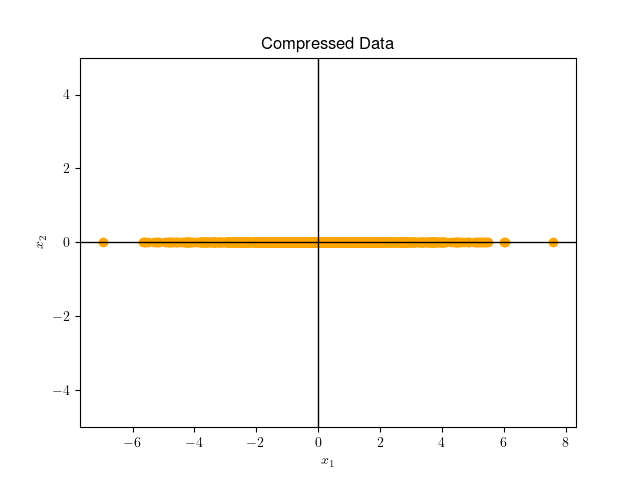

# Вопросы понижения размерности данных: от классических алгоритмов, до современных вариантов на базе ГО.
*Поглазов Никита 2384*

ЛЭТИ 2024 Семинар по ИИ

## Содержание

1. [Введение](#введение)
2. [Мотивация](#мотивация)
3. [Методы понижения размерности: Обзор и Классификация](#методы-понижения-размерности-обзор-и-классификация)
4. [Principal Component Analysis (*PCA*)](#principal-component-analysis-pca)
5. [Linear Discriminant Analysis (*LDA*)](#linear-discriminant-analysis-lda)
6. [*AutoEncoders*](#autoencoders)
7. [Сравнительный анализ методов](#сравнительный-анализ-методов)
8. [Заключение](#заключение)
9. [Список литературы](#список-литературы)

## Введение

В современном мире часто приходится сталкиваться с задачей обработки данных высокой размерности, будь то изображения, текстовые данные или сложные наборы числовых признаков. Однако избыточность данных и так называемое "проклятие размерности" могут значительно ухудшать производительность моделей, затруднять интерпретацию результатов и увеличивать вычислительные затраты.

В свою очередь, методы понижения размерности помогают решать эти проблемы, позволяя выявить наиболее важные признаки, отбрасывая шум и оптимизируя процесс обучения моделей. Существуют как классические методы понижения размерности, такие как анализ главных компонент (PCA) и линейный дискриминантный анализ (LDA), так и современные подходы на основе глубокого обучения, такие как AutoEncoders. Каждый из этих методов имеет свои сильные и слабые стороны, различную применимость в зависимости от типа задачи и структуры данных.

Цель данного доклада — рассмотреть особенности этих методов, их теоретическое обоснование, основные области применения, а также плюсы и минусы каждого подхода.

## Мотивация

### Влияние проклятия размерности на распределение данных

Что такое "проклятие размерности"?

Давайте попробуем разобраться в этом явлении. Для этого проведем небольшой эксперимент с многомерными пространствами. 

Возьмем квадрат со сторонами 1, в который вписан круг.

$S_{square}=1$

$S_{circle}=\pi*(0.5)^2=\frac{\pi}{4}\approx0.79$

То есть круг занимает $\approx79\%$ площади квадрата.

Обобщим задачу до гиперсферы, вписанной в гиперкуб в n-мерном пространстве. Очевидно, что объем гиперкуба остается равным $1$. Но что станет с объемом вписанной гиперсферы? Он увеличится, уменьшится или останется неизменным?

Опытные математики знают ответ на этот вопрос, но его тяжело осознать, ведь, как исторически сложилось, мы живем в трехмерном пространстве.

Объем n-мерной гиперсферы задается следующим соотношением:

$$V_n=C_nR^n$$

$$C_n=\frac{\pi^{n/2}}{\Gamma(\frac{n}{2}+1)}$$

Как видно, в знаменателе стоит Гамма функция, которая растет быстрее экспоненциальной функции в числителе. То есть $\lim_{n\to\infin}V_n=0$.

Тем временем, диагональ гиперкуба будет равна
$$
\sqrt{\sum_{i=1}^n1^2} = \sqrt{n}
$$
То есть она будет постоянно увеличиваться и все больше объема будет приходиться на углы куба.

Если данные будут находиться в $[-\frac{1}{2}, \frac{1}{2}]^n$, то потребуется все больше и больше наблюдений, чтобы с заданной точностью описать вписанную (или, что хуже, произвольную) гиперсферу.

### Влияние на метрические модели

Рассмотрим манхеттенские ($L_1$) расстояния между двумя точками в n-мерном пространстве.

$$
d(x^{(i)}, x^{(j)})=||x^{(i)}- x^{(j)}||_1=\sum_{k=1}^n|x^{(i)}- x^{(j)}|
$$

Согласно закону больших чисел

$$
\lim_{n\to\infin}\frac{d(x^{(i)}, x^{(j)})}n=\mu
$$

Где $\mu$ - среднее расстояние между всеми наблюдениями. 

Также это будет сохраняться и для любой другой $L_p$-нормы.

На графике изображено отношение среднего расстояния между ближайшим соседом с средним расстоянием между двумя точками. В эксперименте генерируется 1000 точек $\xi\sim U([0, 1)^n)$. Расстояние евклидово.

Видно, что с увеличением размерности отношение стремится к 1, т.е. среднее расстояние между ближайшими соседями стремится к среднему расстоянию между двумя точками.

Таким образом, при увеличении размерности, одно и то же количество точек будет находиться в пространстве на все более равном расстоянии. Это серьезно влияет на производительность метрических моделей, таких как kNN и k-Means.

### Влияние на линейные модели

Аналитическое решение задачи линейной регрессии с оптимизацией MSE:

$$
(X^TX)\hat{\beta}=X^Ty
$$
Где $X$ - наблюдения, $y$ - целевые значения, $\hat{\beta}$ - оптимизируемые веса.

При центрировании данных матрица ковариации равна:

$$
\mathrm{Cov}(X)=\frac{1}{k-1}X^TX
$$

Где $k$ - число наблюдений.

Чем более скоррелированны признаки в наблюдениях, тем более близкой к вырожденной становится матрица ковариации, что влечет за собой нестабильные значения весов и переобучение модели. А с ростом размерности увеличивается и вероятность мультиколлинеарности.

### Влияние на "деревянные" модели

Проклятие размерности оказывает сильное влияние на процесс построения дерева решений (*Decision Tree*), ведь с ростом размерности для каждого разбиения становится сложно найти оптимальную точку разделения, так как требуется анализировать экспоненциально больше комбинаций.

Из-за разреженности данных, если большинство признаков нерелевантны, алгоритм может сделать разбиение по случайным направлениям, ухудшая обобщающую способность модели.

Деревья решений известны своей способностью к переобучению, что является еще большей проблемой при высоких размерностях.

По тем же причинам алгоритмы бустинга (AdaBoost и Gradient Boosting в частности) не очень эффективны при больших размерностях, т.к. используют в качестве базовых моделей "слабые" классификаторы (*weak learners*), например решающие пни (деревья глубины 1), которые сами по себе чувствительны к проклятию размерности по вышеописанным причинам.

С другой стороны, случайные леса (*Random Forest*) используют RSM (*Random Subspace Method*) - метод случайного выбора подмножества признаков для каждого дерева, в сочетании с бэггингом для обучения отдельных деревьев, что снижает размерность пространства для обучения. Проблема может возникнуть, в том, случае, если много признаков не коррелируют с целевой переменной, что приведет к увеличению числа моделей в ансамбле.

### Влияние на глубокие нейронные сети

Влияние "проклятия размерности" на глубокие нейронные сети (*DNN*) существенно зависит от их архитектуры, активационных функций и глубины. Несмотря на то, что DNN часто считаются устойчивыми к данным высокой размерности, это не означает, что они полностью свободны от проблем, вызванных разреженностью и избыточностью данных.

Некоторые архитектуры глубоких нейронных сетей, такие как сверточные нейронные сети (*CNN*), рекуррентные нейронные сети (RNN) и трансформеры, имеют механизмы, которые помогают справляться с высокой размерностью данных:

CNN эффективно работают с высокоразмерными входными данными (например, изображениями), выделяя локальные взаимосвязи с помощью сверточных фильтров. Вместо обработки каждого признака по отдельности они сворачивают соседние значения, уменьшая размерность в скрытых слоях.

RNN и LSTM (*Long short-term memory*) справляются с последовательными данными (например, текстами или временными рядами) благодаря способности моделировать временные зависимости. Они эффективно используют архитектуру, где высокая размерность сосредоточена на временных характеристиках, а не на пространственном распределении.

Трансформеры используют механизм внимания (*attention*), позволяющий моделировать только значимые зависимости между признаками. Это делает их особенно устойчивыми при работе с высокоразмерными пространствами, так как они изолируют релевантные признаки, игнорируя нерелевантные.

Несмотря на описанные преимущества, глубокие нейронные сети могут сталкиваться с рядом сложностей. Наличие нерелевантных признаков увеличивает риск запоминания шума, особенно для табличных данных и высокая размерность усложняет поиск глобального минимума в функции потерь градиентными методами.

### Общее влияние

Основная проблема высокой размерности для моделей машинного обучения с учителем заключается в кратном увеличении времени обучения (особенно сильно это затрагивает DNN).

Большое количество признаков мешает интерпретируемости табличных данных, что сильно затрудняет анализ для задач бизнеса.

Также с увеличением числа признаков, растет вероятность того, что часть из них не будет содержать полезной для обучения информации (что особенно влияет на "деревянные" модели). Модель может начать «учиться» на шуме, а не на реальных зависимостях, что приводит к переобучению.

### Выводы

Проклятие размерности оказывает фундаментальное влияние на большинство алгоритмов машинного обучения, требуя либо снижения размерности данных, либо адаптации моделей под многомерные данные.

Теперь, осознав проблематику, можем перейти к одному из способов ее решения: алгоритмам сжатия данных.

## Методы понижения размерности: Обзор и Классификация

Существуют два ключевых подхода к понижению размерности: **отбор признаков** и **преобразование признаков**. В первом случае методы выбирают подмножество исходных переменных, которые лучше всего объясняют данные. Во втором — исходное пространство преобразуется в пространство меньшей размерности с сохранением наиболее значимых свойств.

В этом разделе обзорно рассмотрим большую часть алгоритмов понижения размерности. В следующем разделе максимально подробно рассмотрим самые популярные и часто используемые из них.

### Линейные методы

Линейные методы опираются на предположение, что данные можно эффективно описать в пространстве меньшей размерности при помощи линейных комбинаций исходных признаков.

#### Метод главных компонент (*Principal Component Analysis, PCA*)

PCA — один из наиболее известных методов преобразования признаков. Цель метода заключается в нахождении ортогональных векторов, называемых главными компонентами, которые объясняют максимальную дисперсию в данных.

Часто используется для визуализации высокоразмерных данных. Например, в геномике метод позволяет уменьшить размерность набора данных, содержащего экспрессию тысяч генов, для последующей кластеризации образцов.

#### Разреженный PCA (*Sparse PCA, SPCA*)

Разреженный PCA расширяет стандартный PCA, добавляя ограничение на разреженность главных компонент. Это делает метод особенно полезным для высокоразмерных данных, где многие признаки могут быть нерелевантны.

Применяется для выбора интерпретируемых компонентов в больших наборах данных, например, в финансовой аналитике для выделения ключевых показателей рынка, исключая шумовые признаки.

#### Линейный дискриминантный анализ (*Linear Discriminant Analysis, LDA*)

LDA – это метод, который сочетает снижение размерности с задачей классификации. В отличие от PCA, который сосредоточен на сохранении максимальной дисперсии в данных, LDA оптимизирует разбиение между заранее определенными классами. Этот метод ищет проекции, которые максимизируют разницу между классами, одновременно минимизируя разброс внутри каждого класса.

Основная идея заключается в оптимизации двух матриц: межклассовой дисперсии (между центроидами классов) и внутриклассовой дисперсии (распределения точек внутри каждого класса). Итоговое проецирование основывается на нахождении направлений, которые лучше всего разделяют данные по классам.

Находит широкое применение в задачах, где важна не только визуализация данных, но и разделение классов. Например, в биометрии он используется для обработки изображений лиц. В задаче распознавания лиц LDA помогает выделить направления, где лица из разных классов (разных людей) лучше всего разделяются, сохраняя различия, важные для классификации.

#### Каноническое корреляционное преобразование (*Canonical Correlation Analysis, CCA*)

CCA — метод, нацеленный на изучение корреляций между двумя датасетами. Алгоритм находит линейные комбинации признаков из обоих наборов, которые максимально коррелируют друг с другом.

Удобен для анализа связей между двумя группами данных (например, между анкетными данными и биометрическими показателями).

### Нелинейные методы

Линейные подходы эффективно работают на данных, где зависимости между признаками можно выразить линейными комбинациями. Однако многие реальные задачи требуют работы с нелинейными структурами данных. Нелинейные методы снижения размерности адаптированы для работы с такими случаями, раскрывая сложные взаимосвязи между признаками, которые невозможно отобразить линейными моделями.

#### Ядерный PCA (*Kernel PCA, KPCA*)

Ядерный PCA представляет собой расширение классического PCA для работы с нелинейными структурами данных. Основная идея заключается в использовании **ядерной функции (*kernel function*)**, которая позволяет выполнить преобразование исходных данных в пространство более высокой размерности, где линейные зависимости становятся более явными. Затем метод PCA применяется уже в этом новом пространстве.

Используемая ядерная функция, например, **гауссовское ядро (*gaussian kernel*)**, создает возможность изучения сложных взаимосвязей в данных без необходимости явного вычисления координат в новом пространстве благодаря **ядерному трюку (*kernel trick*)**.

Ядерный PCA находит применение в задачах с данными, имеющими сложную нелинейную структуру. Например, в задачах анализа изображений он помогает выявлять скрытые шаблоны, такие как текстуры или формы объектов, которые трудно определить линейными методами. Кроме того, метод эффективен в задачах биоинформатики, таких как предсказание активности молекул на основе их химической структуры.

#### t-SNE (*t-Distributed Stochastic Neighbor Embedding*)

t-SNE – метод, разработанный для визуализации данных высокой размерности в пространствах низкой размерности (чаще всего в двух или трех). Он не сохраняет глобальную структуру данных, но стремится сохранить локальные расстояния между точками, что делает его особенно полезным для обнаружения кластеров.

Основная идея t-SNE заключается в том, чтобы минимизировать расхождение между распределением пар расстояний в исходном пространстве и их отображением в пространстве низкой размерности. Для этого используется **расстояние Кульбака-Лейблера (*KL-divergence*)**, которое измеряет различие между двумя вероятностными распределениями.

t-SNE особенно популярен в задачах визуализации результатов моделей, например, для кластеризации геномных данных или оценки эмбеддингов, созданных глубокими нейронными сетями.

#### UMAP (*Uniform Manifold Approximation and Projection*)

UMAP – это более современный метод, разработанный для решения тех же задач, что и t-SNE, но с улучшенной производительностью и дополнительной способностью сохранять глобальные структуры данных. UMAP опирается на теорию топологии и стремится сохранять геометрические свойства исходного пространства.

Метод строит взвешенный граф соседей данных в исходном пространстве, а затем аппроксимирует его в пространстве меньшей размерности, минимизируя расхождения. В отличие от t-SNE, UMAP масштабируется лучше на больших объемах данных и может использоваться не только для визуализации, но и для предобработки данных перед обучением моделей.

Примером успешного применения UMAP является визуализация паттернов активности мозга на основе сигналов ЭЭГ, где важно учитывать как локальные, так и глобальные взаимосвязи в данных.

#### Автоэнкодеры (AutoEncoders)

Автоэнкодеры – это семейство нейронных сетей, которые обучаются сжимать данные в пространство меньшей размерности, а затем восстанавливать их в исходной форме. Они состоят из двух частей: кодировщика, который преобразует данные в представление с низкой размерностью, и декодировщика, который восстанавливает данные обратно.

Обучение автоэнкодера происходит путем минимизации функции потерь, измеряющей разницу между входными данными и их восстановленной версией. Это позволяет сети находить компактные представления данных, сохраняя важную информацию.

Автоэнкодеры широко применяются в задачах сжатия изображений, обнаружения аномалий и генерации данных. Например, в обработке изображений автоэнкодеры могут эффективно удалять шум, выделяя только значимые структуры данных.

#### Вариационные автоэнкодеры (*Variational AutoEncoders, VAEs*)

Вариационные автоэнкодеры являются расширением классических автоэнкодеров. Они используются для снижения размерности данных и генерации новых образцов, похожих на исходные. Отличие от стандартных автокодировщиков заключается в вероятностной интерпретации скрытого пространства.

Ключевая идея заключается в том, чтобы представлять сжатые данные не как фиксированное значение, а как распределение, параметры которого (среднее и дисперсия) обучаются в процессе оптимизации. Это достигается добавлением к функции потерь термина, минимизирующего расхождение между апостериорным распределением в скрытом пространстве и заданным априорным распределением (обычно нормальным).  

Преимущества VAEs:  
- Они создают **непрерывное скрытое пространство**, что позволяет эффективно интерполировать между точками в данных.  
- Поддерживают генерацию новых данных (например, изображений, текстов или сигналов), что делает их популярными в задачах обработки изображений и работы с текстовыми данными.  

Примером использования VAEs является генерация новых образцов в биологии, таких как синтез молекул с заданными свойствами, или улучшение качества изображений через удаление шумов.

###  Выводы

Мы рассмотрели основные методы понижения размерности, которые можно разделить на линейные и нелинейные подходы. Каждый из них имеет свои особенности и области применения, в зависимости от структуры данных и целей задачи.

Чтобы успешно применять методы сжатия данных, важно понимать их теоретические основы, ограничения и условия, при которых они работают наиболее эффективно. В следующем разделе мы детально исследуем теорию, лежащую в основе некоторых из описанных подходов. После этого мы рассмотрим их практическое применение, чтобы показать, как алгоритмы работают в реальных задачах и какие результаты они могут дать.

## Principal Component Analysis (*PCA*)

### Постановка задачи

Дан **неразмеченный** датасет из **независимых и одинаково распределенных (*i.i.d*)** данных $X = \{\boldsymbol{x}_i\}_{i=1}^N,\:\boldsymbol{x}_i\in\mathbb{R}^D$. 
Без потери общности предполагаем, что данные центрированы, т.е. $\mathbb{E}[\boldsymbol{x}_i] = 0$.
Тогда матрица ковариации данных выражается как:

$$
\boldsymbol{\Sigma} = \frac{1}{N}\sum_{i=1}^N\boldsymbol{x}_i\boldsymbol{x}_i^T.
$$

Положим, что существует сжатое представление (кодировка) данных 

$$
\boldsymbol{z}_i=\mathbf{B}^T\boldsymbol{x}_i\in\mathbb{R}^M,\:M<D
$$

где 
$$
\mathbf{B} = [\boldsymbol{b}_1, \boldsymbol{b}_2, \ldots,\:\boldsymbol{b}_M]\in\mathbb{R}^{D\times M}, \boldsymbol{b}_i^T\boldsymbol{b}_j=\delta_{ij}=\begin{cases}
    0, & i\neq j,\\
    1, & i=j.
\end{cases}
$$

то есть, $\mathbf{B}$ - ортогональный базис, $\boldsymbol{z}_i$ - координаты вектора $\boldsymbol{x}_i$ в новом базисе.
 
Тогда $\tilde{\boldsymbol{x}_i}=\mathbf{B}\boldsymbol{z}_i$ - восстановленный вектор $\boldsymbol{x}_i$ в исходном пространстве.

#### Простой пример

$\boldsymbol{x}_i\in\mathbb{R}^2:$

Пусть $\mathbf{B}=\begin{bmatrix} 1 \\ 0 \end{bmatrix}$, тогда $\boldsymbol{z}_i = \mathbf{B}^T\boldsymbol{x}_i = \boldsymbol{x}_{i1}$ - первая компонента вектора $\boldsymbol{x}_i$.

Пусть $\boldsymbol{x}=\begin{bmatrix} 5 \\ \frac{1}{100} \end{bmatrix}$, тогда $\boldsymbol{z} = \begin{bmatrix} 1 & 0 \end{bmatrix}\begin{bmatrix} 5 \\ \frac{1}{100} \end{bmatrix}=\begin{bmatrix} 5 \end{bmatrix}$.

Тогда $\tilde{\boldsymbol{x}} = \begin{bmatrix} 1 \\ 0 \end{bmatrix} \begin{bmatrix} 5 \end{bmatrix} = \begin{bmatrix} 5 \\ 0 \end{bmatrix}$ - вектор в исходном пространстве.

### Нахождение направления с наибольшей дисперсией

Если мы рассматриваем содержание информации в данных как заполненность пространства, то мы хотим чтобы дисперсия сжатых данных, как показатель разброса, была максимальной.

Начнем с поиска направления, вдоль которого дисперсия данных максимальна, то есть дисперсии первой координаты $\boldsymbol{z}$ - $z_1$:

$$
\begin{align*}
V_1 := \mathbb{D}[z_1] &= \frac{1}{N}\sum_{i=1}^Nz_{1i}^2 = \frac{1}{N}\sum_{i=1}^N(\boldsymbol{b}_1^T\boldsymbol{x}_i)^2  \\ 
&= \frac{1}{N}\sum_{i=1}^N(\boldsymbol{b}_1^Tx_ix_i^T\boldsymbol{b}_1) \\ 
&= \boldsymbol{b}_1^T\left(\frac{1}{N}\sum_{i=1}^Nx_ix_i^T\right)\boldsymbol{b}_1 \\ 
&= \boldsymbol{b}_1^T\boldsymbol{\Sigma}\boldsymbol{b}_1.
\end{align*}
$$

Одна из причин, почему базис $\mathbf{B}$ ортонормирован, заключается в том, что $V_1$ квадратично зависит от $\boldsymbol{b}_1$ и если бы $\boldsymbol{b}_1$ был не нормирован, то мы могли бы увеличить $V_1$ путем увеличения длины $\boldsymbol{b}_1$. 

Таким образом, имеем задачу условной оптимизации:

$$
\begin{align*}
    &\max_{\boldsymbol{b}_1} \boldsymbol{b}_1^T\boldsymbol{\Sigma}\boldsymbol{b}_1, \\
    &\text{s.t.}\:\boldsymbol{b}_1^T\boldsymbol{b}_1 = 1.
\end{align*}
$$

Получаем функцию Лагранжа:

$$
\mathcal{L}(\boldsymbol{b}_1, \lambda) = \boldsymbol{b}_1^T\boldsymbol{\Sigma}\boldsymbol{b}_1 - \lambda_1(\boldsymbol{b}_1^T\boldsymbol{b}_1 - 1).
$$

Частные производные по $\boldsymbol{b}_1$ и $\lambda$:

$$
\begin{align*}
    \frac{\partial\mathcal{L}}{\partial\boldsymbol{b}_1} &= 2\boldsymbol{\Sigma}\boldsymbol{b}_1 - 2\lambda_1\boldsymbol{b}_1 = 0, \\
    \frac{\partial\mathcal{L}}{\partial\lambda_1} &= -\boldsymbol{b}_1^T\boldsymbol{b}_1 + 1 = 0.
\end{align*}
$$

Следовательно:

$$
\begin{align*}
    &\boldsymbol{\Sigma}\boldsymbol{b}_1 = \lambda_1\boldsymbol{b}_1, \\
    &\boldsymbol{b}_1^T\boldsymbol{b}_1 = 1.
\end{align*}
$$

Таким образом, $\boldsymbol{b}_1$ - собственный вектор матрицы ковариации $\boldsymbol{\Sigma}$, а $\lambda_1$ - собственное значение.

Теперь можем переписать дисперсию $V_1$ как:

$$
V_1 = \boldsymbol{b}_1^T\boldsymbol{\Sigma}\boldsymbol{b}_1 = \lambda_1\boldsymbol{b}_1^T\boldsymbol{b}_1 = \lambda_1.
$$

$\boldsymbol{b}_1$ - первая главная компонента, а $\lambda_1$ - дисперсия вдоль этого направления. Также, поскольку $\sqrt{\lambda_1}$ - стандартное отклонение, то его называют нагрузкой первой главной компоненты.

### Нахождение остальных главных компонент

Положим, что мы уже нашли $m - 1$ главных компонент как собственные векторы матрицы ковариации. Поскольку $\boldsymbol{\Sigma}$ - симметричная, то по спектральной теореме мы можем использовать эти векторы как ортонормированный базис подпространства размерности $m-1$ в $\mathbb{R}^D$.

Тогда, чтобы найти $m$-ю главную компоненту, мы можем рассмотреть новую задачу условной оптимизации:

$$
\begin{align*}
    &\max_{\boldsymbol{b}_m} \boldsymbol{b}_m^T\boldsymbol{\Sigma}\boldsymbol{b}_m, \\
    &\text{s.t.}\:\boldsymbol{b}_m^T\boldsymbol{b}_m = 1, \\
    &\boldsymbol{b}_m^T\boldsymbol{b}_i = 0,\:\forall i<m.
\end{align*}
$$

Функция Лагранжа:

$$
\mathcal{L}(\boldsymbol{b}_m, \lambda_m, \boldsymbol{\mu}) = \boldsymbol{b}_m^T\boldsymbol{\Sigma}\boldsymbol{b}_m - \lambda_m(\boldsymbol{b}_m^T\boldsymbol{b}_m - 1) - \sum_{i=1}^{m-1}\mu_i\boldsymbol{b}_m^T\boldsymbol{b}_i.
$$

Частные производные:

$$
\begin{align*}
    \frac{\partial\mathcal{L}}{\partial\boldsymbol{b}_m} &= 2\boldsymbol{\Sigma}\boldsymbol{b}_m - 2\lambda_m\boldsymbol{b}_m - \sum_{i=1}^{m-1}\mu_i\boldsymbol{b}_i = 0, \\
    \frac{\partial\mathcal{L}}{\partial\lambda_m} &= -\boldsymbol{b}_m^T\boldsymbol{b}_m + 1 = 0, \\
    \frac{\partial\mathcal{L}}{\partial\mu_i} &= -\boldsymbol{b}_m^T\boldsymbol{b}_i = 0,\:\forall i<m.
\end{align*}
$$

Домножим первое уравнение на $\boldsymbol{b}_j^T,\:j<m$ слева:

$$
2\boldsymbol{b}_j^T\boldsymbol{\Sigma}\boldsymbol{b}_m - 2\lambda_m\boldsymbol{b}_j^T\boldsymbol{b}_m - \sum_{i=1}^{m-1}\mu_i\boldsymbol{b}_j^T\boldsymbol{b}_i = 0,
$$

поскольку $\boldsymbol{b}_j^T\boldsymbol{b}_i = \delta_{ji}$:

$$
2\boldsymbol{b}_j^T\boldsymbol{\Sigma}\boldsymbol{b}_m - \mu_j = 0.
$$

$\boldsymbol{\Sigma}$ симметрична, поэтому $\boldsymbol{b}_j^T\boldsymbol{\Sigma}\boldsymbol{b}_m = \boldsymbol{\Sigma}\boldsymbol{b}_j^T\boldsymbol{b}_m=0$. Тогда $\mu_j = 0.$ и, аналогично, $\mu_j=0,\:\forall j<m$. Таким образом:

$$
\boldsymbol{\Sigma}\boldsymbol{b}_m = \lambda_m\boldsymbol{b}_m, \\
$$

Вновь, $\boldsymbol{b}_m$ - собственный вектор матрицы ковариации $\boldsymbol{\Sigma}$, а $\lambda_m$ - собственное значение.

Таким образом, объясненная дисперсия первых $m$ главных компонент равна $\sum_{i=1}^m\lambda_i$. Также вместо абсолютных величин, мы можем использовать долю объясненной дисперсии, которая равна $\frac{\sum_{i=1}^m\lambda_i}{\sum_{i=1}^D\lambda_i}$.

### Практическое применение

**Замечание:** в приведенных выше формулах строение матрицы $X$ отличается от привычного - строки матрицы $X$ - это признаки, а столбцы - объекты. Поэтому, на практике формулы кодирования и декодирования данных в пространстве главных компонент будут отличаться от выше приведенных:

$$
\begin{align*}
    \boldsymbol{Z} &= \mathbf{B}^T\boldsymbol{X}, \\
    \tilde{\boldsymbol{X}} &= \mathbf{B}\boldsymbol{Z}.
\end{align*}
$$

а также матрица ковариации (при центрировании данных):

$$
\boldsymbol{\Sigma} = \frac{1}{N}\boldsymbol{X}\boldsymbol{X}^T.
$$

http://www.machinelearning.ru/wiki/index.php?title=%D0%9F%D1%80%D0%BE%D0%BA%D0%BB%D1%8F%D1%82%D0%B8%D0%B5_%D1%80%D0%B0%D0%B7%D0%BC%D0%B5%D1%80%D0%BD%D0%BE%D1%81%D1%82%D0%B8

https://habr.com/ru/companies/wunderfund/articles/748044/

https://ru.wikipedia.org/wiki/%D0%93%D0%B8%D0%BF%D0%B5%D1%80%D1%81%D1%84%D0%B5%D1%80%D0%B0

https://stats.stackexchange.com/questions/186184/does-dimensionality-curse-effect-some-models-more-than-others

https://education.yandex.ru/handbook/ml/article/linear-models

https://habr.com/ru/articles/799001/

"Mathematics for Machine Learning" 2020 - Marc Peter Deisenroth, A. Aldo Faisal, Cheng Soon Ong