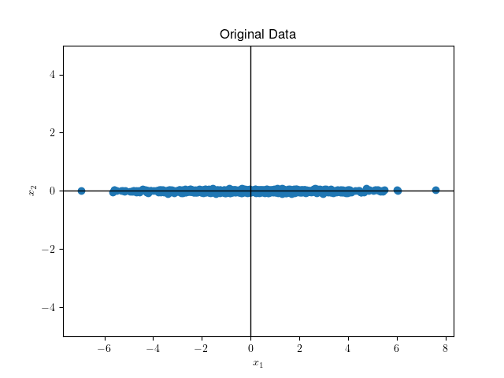

# Вопросы понижения размерности данных: от классических алгоритмов, до современных вариантов на базе ГО.
*Поглазов Никита 2384*

ЛЭТИ 2024 Семинар по ИИ

## Содержание

1. [Введение](#введение)
2. [Мотивация](#мотивация)
3. [Методы понижения размерности: Обзор и Классификация](#методы-понижения-размерности-обзор-и-классификация)
4. [Principal Component Analysis (*PCA*)](#principal-component-analysis-pca)
5. [Kernel Principal Component Analysis (*KPCA*)](#kernel-principal-component-analysis-kpca)
6. [AutoEncoders (*AEs*)](#autoencoders-aes)
7. [Variational AutoEncoders (*VAEs*)](#variational-autoencoders-vaes)
8. [Сравнительный анализ методов](#сравнительный-анализ-методов)
9. [Заключение](#заключение)
10. [Список литературы](#список-литературы)

## Введение

В современном мире часто приходится сталкиваться с задачей обработки данных высокой размерности, будь то изображения, текстовые данные или сложные наборы числовых признаков. Однако избыточность данных и так называемое "проклятие размерности" могут значительно ухудшать производительность моделей, затруднять интерпретацию результатов и увеличивать вычислительные затраты.

В свою очередь, методы понижения размерности помогают решать эти проблемы, позволяя выявить наиболее важные признаки, отбрасывая шум и оптимизируя процесс обучения моделей. Существуют как классические методы понижения размерности, такие как анализ главных компонент (PCA) и линейный дискриминантный анализ (LDA), так и современные подходы на основе глубокого обучения, такие как AutoEncoders. Каждый из этих методов имеет свои сильные и слабые стороны, различную применимость в зависимости от типа задачи и структуры данных.

Цель данного доклада — рассмотреть особенности этих методов, их теоретическое обоснование, основные области применения, а также плюсы и минусы каждого подхода.

## Мотивация

### Влияние проклятия размерности на распределение данных

Что такое "проклятие размерности"?

Давайте попробуем разобраться в этом явлении. Для этого проведем небольшой эксперимент с многомерными пространствами. 

Возьмем квадрат со сторонами 1, в который вписан круг.

$S_{square}=1$

$S_{circle}=\pi*(0.5)^2=\frac{\pi}{4}\approx0.79$

То есть круг занимает $\approx79\%$ площади квадрата.

Обобщим задачу до гиперсферы, вписанной в гиперкуб в n-мерном пространстве. Очевидно, что объем гиперкуба остается равным $1$. Но что станет с объемом вписанной гиперсферы? Он увеличится, уменьшится или останется неизменным?

Опытные математики знают ответ на этот вопрос, но его тяжело осознать, ведь, как исторически сложилось, мы живем в трехмерном пространстве.

Объем n-мерной гиперсферы задается следующим соотношением:

$$V_n=C_nR^n$$

$$C_n=\frac{\pi^{n/2}}{\Gamma(\frac{n}{2}+1)}$$

Как видно, в знаменателе стоит Гамма функция, которая растет быстрее экспоненциальной функции в числителе. То есть $\lim_{n\to\infin}V_n=0$.

Тем временем, диагональ гиперкуба будет равна
$$
\sqrt{\sum_{i=1}^n1^2} = \sqrt{n}
$$
То есть она будет постоянно увеличиваться и все больше объема будет приходиться на углы куба.

Если данные будут находиться в $[-\frac{1}{2}, \frac{1}{2}]^n$, то потребуется все больше и больше наблюдений, чтобы с заданной точностью описать вписанную (или, что хуже, произвольную) гиперсферу.

### Влияние на метрические модели

Рассмотрим манхеттенские ($L_1$) расстояния между двумя точками в n-мерном пространстве.

$$
d(x^{(i)}, x^{(j)})=||x^{(i)}- x^{(j)}||_1=\sum_{k=1}^n|x^{(i)}- x^{(j)}|
$$

Согласно закону больших чисел

$$
\lim_{n\to\infin}\frac{d(x^{(i)}, x^{(j)})}n=\mu
$$

Где $\mu$ - среднее расстояние между всеми наблюдениями. 

Также это будет сохраняться и для любой другой $L_p$-нормы.

На графике изображено отношение среднего расстояния между ближайшим соседом с средним расстоянием между двумя точками. В эксперименте генерируется 1000 точек $\xi\sim U([0, 1)^n)$. Расстояние евклидово.

Видно, что с увеличением размерности отношение стремится к 1, т.е. среднее расстояние между ближайшими соседями стремится к среднему расстоянию между двумя точками.

Таким образом, при увеличении размерности, одно и то же количество точек будет находиться в пространстве на все более равном расстоянии. Это серьезно влияет на производительность метрических моделей, таких как kNN и k-Means.

### Влияние на линейные модели

Аналитическое решение задачи линейной регрессии с оптимизацией MSE:

$$
(X^TX)\hat{\beta}=X^Ty
$$
Где $X$ - наблюдения, $y$ - целевые значения, $\hat{\beta}$ - оптимизируемые веса.

При центрировании данных матрица ковариации равна:

$$
\mathrm{Cov}(X)=\frac{1}{k-1}X^TX
$$

Где $k$ - число наблюдений.

Чем более скоррелированны признаки в наблюдениях, тем более близкой к вырожденной становится матрица ковариации, что влечет за собой нестабильные значения весов и переобучение модели. А с ростом размерности увеличивается и вероятность мультиколлинеарности.

### Влияние на "деревянные" модели

Проклятие размерности оказывает сильное влияние на процесс построения дерева решений (*Decision Tree*), ведь с ростом размерности для каждого разбиения становится сложно найти оптимальную точку разделения, так как требуется анализировать экспоненциально больше комбинаций.

Из-за разреженности данных, если большинство признаков нерелевантны, алгоритм может сделать разбиение по случайным направлениям, ухудшая обобщающую способность модели.

Деревья решений известны своей способностью к переобучению, что является еще большей проблемой при высоких размерностях.

По тем же причинам алгоритмы бустинга (AdaBoost и Gradient Boosting в частности) не очень эффективны при больших размерностях, т.к. используют в качестве базовых моделей "слабые" классификаторы (*weak learners*), например решающие пни (деревья глубины 1), которые сами по себе чувствительны к проклятию размерности по вышеописанным причинам.

С другой стороны, случайные леса (*Random Forest*) используют RSM (*Random Subspace Method*) - метод случайного выбора подмножества признаков для каждого дерева, в сочетании с бэггингом для обучения отдельных деревьев, что снижает размерность пространства для обучения. Проблема может возникнуть, в том, случае, если много признаков не коррелируют с целевой переменной, что приведет к увеличению числа моделей в ансамбле.

### Влияние на глубокие нейронные сети

Влияние "проклятия размерности" на глубокие нейронные сети (*DNN*) существенно зависит от их архитектуры, активационных функций и глубины. Несмотря на то, что DNN часто считаются устойчивыми к данным высокой размерности, это не означает, что они полностью свободны от проблем, вызванных разреженностью и избыточностью данных.

Некоторые архитектуры глубоких нейронных сетей, такие как сверточные нейронные сети (*CNN*), рекуррентные нейронные сети (RNN) и трансформеры, имеют механизмы, которые помогают справляться с высокой размерностью данных:

CNN эффективно работают с высокоразмерными входными данными (например, изображениями), выделяя локальные взаимосвязи с помощью сверточных фильтров. Вместо обработки каждого признака по отдельности они сворачивают соседние значения, уменьшая размерность в скрытых слоях.

RNN и LSTM (*Long short-term memory*) справляются с последовательными данными (например, текстами или временными рядами) благодаря способности моделировать временные зависимости. Они эффективно используют архитектуру, где высокая размерность сосредоточена на временных характеристиках, а не на пространственном распределении.

Трансформеры используют механизм внимания (*attention*), позволяющий моделировать только значимые зависимости между признаками. Это делает их особенно устойчивыми при работе с высокоразмерными пространствами, так как они изолируют релевантные признаки, игнорируя нерелевантные.

Несмотря на описанные преимущества, глубокие нейронные сети могут сталкиваться с рядом сложностей. Наличие нерелевантных признаков увеличивает риск запоминания шума, особенно для табличных данных и высокая размерность усложняет поиск глобального минимума в функционале потерь градиентными методами.

### Общее влияние

Основная проблема высокой размерности для моделей машинного обучения с учителем заключается в кратном увеличении времени обучения (особенно сильно это затрагивает DNN).

Большое количество признаков мешает интерпретируемости табличных данных, что сильно затрудняет анализ для задач бизнеса.

Также с увеличением числа признаков, растет вероятность того, что часть из них не будет содержать полезной для обучения информации (что особенно влияет на "деревянные" модели). Модель может начать «учиться» на шуме, а не на реальных зависимостях, что приводит к переобучению.

### Выводы

Проклятие размерности оказывает фундаментальное влияние на большинство алгоритмов машинного обучения, требуя либо снижения размерности данных, либо адаптации моделей под многомерные данные.

Теперь, осознав проблематику, можем перейти к одному из способов ее решения: алгоритмам сжатия данных.

## Методы понижения размерности: Обзор и Классификация

Существуют два ключевых подхода к понижению размерности: **отбор признаков** и **преобразование признаков**. В первом случае методы выбирают подмножество исходных переменных, которые лучше всего объясняют данные. Во втором — исходное пространство преобразуется в пространство меньшей размерности с сохранением наиболее значимых свойств.

В этом разделе обзорно рассмотрим большую часть алгоритмов понижения размерности. В следующем разделе максимально подробно рассмотрим самые популярные и часто используемые из них.

### Линейные методы

Линейные методы опираются на предположение, что данные можно эффективно описать в пространстве меньшей размерности при помощи линейных комбинаций исходных признаков.

#### Метод главных компонент (*Principal Component Analysis, PCA*)

PCA — один из наиболее известных методов преобразования признаков. Цель метода заключается в нахождении ортогональных векторов, называемых главными компонентами, которые объясняют максимальную дисперсию в данных.

Часто используется для визуализации высокоразмерных данных. Например, в геномике метод позволяет уменьшить размерность набора данных, содержащего экспрессию тысяч генов, для последующей кластеризации образцов.

#### Разреженный PCA (*Sparse PCA, SPCA*)

Разреженный PCA расширяет стандартный PCA, добавляя ограничение на разреженность главных компонент. Это делает метод особенно полезным для высокоразмерных данных, где многие признаки могут быть нерелевантны.

Применяется для выбора интерпретируемых компонентов в больших наборах данных, например, в финансовой аналитике для выделения ключевых показателей рынка, исключая шумовые признаки.

#### Линейный дискриминантный анализ (*Linear Discriminant Analysis, LDA*)

LDA – это метод, который сочетает снижение размерности с задачей классификации. В отличие от PCA, который сосредоточен на сохранении максимальной дисперсии в данных, LDA оптимизирует разбиение между заранее определенными классами. Этот метод ищет проекции, которые максимизируют разницу между классами, одновременно минимизируя разброс внутри каждого класса.

Основная идея заключается в оптимизации двух матриц: межклассовой дисперсии (между центроидами классов) и внутриклассовой дисперсии (распределения точек внутри каждого класса). Итоговое проецирование основывается на нахождении направлений, которые лучше всего разделяют данные по классам.

Находит широкое применение в задачах, где важна не только визуализация данных, но и разделение классов. Например, в биометрии он используется для обработки изображений лиц. В задаче распознавания лиц LDA помогает выделить направления, где лица из разных классов (разных людей) лучше всего разделяются, сохраняя различия, важные для классификации.

#### Каноническое корреляционное преобразование (*Canonical Correlation Analysis, CCA*)

CCA — метод, нацеленный на изучение корреляций между двумя датасетами. Алгоритм находит линейные комбинации признаков из обоих наборов, которые максимально коррелируют друг с другом.

Удобен для анализа связей между двумя группами данных (например, между анкетными данными и биометрическими показателями).

### Нелинейные методы

Линейные подходы эффективно работают на данных, где зависимости между признаками можно выразить линейными комбинациями. Однако многие реальные задачи требуют работы с нелинейными структурами данных. Нелинейные методы снижения размерности адаптированы для работы с такими случаями, раскрывая сложные взаимосвязи между признаками, которые невозможно отобразить линейными моделями.

#### Ядерный PCA (*Kernel PCA, KPCA*)

Ядерный PCA представляет собой расширение классического PCA для работы с нелинейными структурами данных. Основная идея заключается в использовании **ядерной функции (*kernel function*)**, которая позволяет выполнить преобразование исходных данных в пространство более высокой размерности, где линейные зависимости становятся более явными. Затем метод PCA применяется уже в этом новом пространстве.

Используемая ядерная функция, например, **гауссовское ядро (*gaussian kernel*)**, создает возможность изучения сложных взаимосвязей в данных без необходимости явного вычисления координат в новом пространстве благодаря **ядерному трюку (*kernel trick*)**.

Ядерный PCA находит применение в задачах с данными, имеющими сложную нелинейную структуру. Например, в задачах анализа изображений он помогает выявлять скрытые шаблоны, такие как текстуры или формы объектов, которые трудно определить линейными методами. Кроме того, метод эффективен в задачах биоинформатики, таких как предсказание активности молекул на основе их химической структуры.

#### t-SNE (*t-Distributed Stochastic Neighbor Embedding*)

t-SNE – метод, разработанный для визуализации данных высокой размерности в пространствах низкой размерности (чаще всего в двух или трех). Он не сохраняет глобальную структуру данных, но стремится сохранить локальные расстояния между точками, что делает его особенно полезным для обнаружения кластеров.

Основная идея t-SNE заключается в том, чтобы минимизировать расхождение между распределением пар расстояний в исходном пространстве и их отображением в пространстве низкой размерности. Для этого используется **расстояние Кульбака-Лейблера (*KL-divergence*)**, которое измеряет различие между двумя вероятностными распределениями.

t-SNE особенно популярен в задачах визуализации результатов моделей, например, для кластеризации геномных данных или оценки эмбеддингов, созданных глубокими нейронными сетями.

#### UMAP (*Uniform Manifold Approximation and Projection*)

UMAP – это более современный метод, разработанный для решения тех же задач, что и t-SNE, но с улучшенной производительностью и дополнительной способностью сохранять глобальные структуры данных. UMAP опирается на теорию топологии и стремится сохранять геометрические свойства исходного пространства.

Метод строит взвешенный граф соседей данных в исходном пространстве, а затем аппроксимирует его в пространстве меньшей размерности, минимизируя расхождения. В отличие от t-SNE, UMAP масштабируется лучше на больших объемах данных и может использоваться не только для визуализации, но и для предобработки данных перед обучением моделей.

Примером успешного применения UMAP является визуализация паттернов активности мозга на основе сигналов ЭЭГ, где важно учитывать как локальные, так и глобальные взаимосвязи в данных.

#### Автоэнкодеры (AutoEncoders)

Автоэнкодеры – это семейство нейронных сетей, которые обучаются сжимать данные в пространство меньшей размерности, а затем восстанавливать их в исходной форме. Они состоят из двух частей: кодировщика, который преобразует данные в представление с низкой размерностью, и декодировщика, который восстанавливает данные обратно.

Обучение автоэнкодера происходит путем минимизации функционала потерь, измеряющей разницу между входными данными и их восстановленной версией. Это позволяет сети находить компактные представления данных, сохраняя важную информацию.

Автоэнкодеры широко применяются в задачах сжатия изображений, обнаружения аномалий и генерации данных. Например, в обработке изображений автоэнкодеры могут эффективно удалять шум, выделяя только значимые структуры данных.

#### Вариационные автоэнкодеры (*Variational AutoEncoders, VAEs*)

Вариационные автоэнкодеры являются расширением классических автоэнкодеров. Они используются для снижения размерности данных и генерации новых образцов, похожих на исходные. Отличие от стандартных автокодировщиков заключается в вероятностной интерпретации скрытого пространства.

Ключевая идея заключается в том, чтобы представлять сжатые данные не как фиксированное значение, а как распределение, параметры которого (среднее и дисперсия) обучаются в процессе оптимизации. Это достигается добавлением к функционалу потерь термина, минимизирующего расхождение между апостериорным распределением в скрытом пространстве и заданным априорным распределением (обычно нормальным).  

Преимущества VAEs:  
- Они создают **непрерывное скрытое пространство**, что позволяет эффективно интерполировать между точками в данных.  
- Поддерживают генерацию новых данных (например, изображений, текстов или сигналов), что делает их популярными в задачах обработки изображений и работы с текстовыми данными.  

Примером использования VAEs является генерация новых образцов в биологии, таких как синтез молекул с заданными свойствами, или улучшение качества изображений через удаление шумов.

###  Выводы

Мы рассмотрели основные методы понижения размерности, которые можно разделить на линейные и нелинейные подходы. Каждый из них имеет свои особенности и области применения, в зависимости от структуры данных и целей задачи.

Чтобы успешно применять эти методы, важно понимать их теоретические основы, ограничения и условия, при которых они работают наиболее эффективно. В следующем разделе мы детально исследуем теорию, лежащую в основе некоторых из описанных подходов. После этого мы рассмотрим их практическое применение, чтобы показать, как алгоритмы работают в реальных задачах и какие результаты они могут дать.

## Principal Component Analysis (*PCA*)

### Постановка задачи

Дан **неразмеченный** датасет из **независимых и одинаково распределенных (*i.i.d*)** данных $X = \{\boldsymbol{x}_i\}_{i=1}^N,\:\boldsymbol{x}_i\in\mathbb{R}^D$. 
Без потери общности предполагаем, что данные центрированы, т.е. $\mathbb{E}[\boldsymbol{x}_i] = 0$.
Тогда матрица ковариации данных выражается как:

$$
\boldsymbol{\Sigma} = \frac{1}{N}\sum_{i=1}^N\boldsymbol{x}_i\boldsymbol{x}_i^T.
$$

Положим, что существует сжатое представление (кодировка) данных, полученных после линейного преобразования

$$
\boldsymbol{z}_i=\mathbf{B}^T\boldsymbol{x}_i\in\mathbb{R}^M,\:M<D
$$

где 
$$
\mathbf{B} = [\boldsymbol{b}_1, \boldsymbol{b}_2, \ldots,\:\boldsymbol{b}_M]\in\mathbb{R}^{D\times M}, \boldsymbol{b}_i^T\boldsymbol{b}_j=\delta_{ij}=\begin{cases}
    0, & i\neq j,\\
    1, & i=j.
\end{cases}
$$

то есть, $\mathbf{B}$ - ортогональный базис, $\boldsymbol{z}_i$ - координаты вектора $\boldsymbol{x}_i$ в новом базисе.
 
Тогда $\tilde{\boldsymbol{x}_i}=\mathbf{B}\boldsymbol{z}_i$ - восстановленный вектор $\boldsymbol{x}_i$ в исходном пространстве.

#### Простой пример

$\boldsymbol{x}_i\in\mathbb{R}^2:$

Пусть $\mathbf{B}=\begin{bmatrix} 1 \\ 0 \end{bmatrix}$, тогда $\boldsymbol{z}_i = \mathbf{B}^T\boldsymbol{x}_i = \boldsymbol{x}_{i1}$ - первая компонента вектора $\boldsymbol{x}_i$.

Пусть $\boldsymbol{x}=\begin{bmatrix} 5 \\ \frac{1}{100} \end{bmatrix}$, тогда $\boldsymbol{z} = \begin{bmatrix} 1 & 0 \end{bmatrix}\begin{bmatrix} 5 \\ \frac{1}{100} \end{bmatrix}=\begin{bmatrix} 5 \end{bmatrix}$.

Тогда $\tilde{\boldsymbol{x}} = \begin{bmatrix} 1 \\ 0 \end{bmatrix} \begin{bmatrix} 5 \end{bmatrix} = \begin{bmatrix} 5 \\ 0 \end{bmatrix}$ - вектор в исходном пространстве.

### Нахождение направления с наибольшей дисперсией

Если мы рассматриваем содержание информации в данных как заполненность пространства, то мы хотим чтобы дисперсия сжатых данных, как показатель разброса, была максимальной.

Начнем с поиска направления, вдоль которого дисперсия данных максимальна, то есть дисперсии первой координаты $\boldsymbol{z}$ - $z_1$:

$$
\begin{align*}
V_1 := \mathbb{D}[z_1] &= \frac{1}{N}\sum_{i=1}^Nz_{1i}^2 = \frac{1}{N}\sum_{i=1}^N(\boldsymbol{b}_1^T\boldsymbol{x}_i)^2  \\ 
&= \frac{1}{N}\sum_{i=1}^N(\boldsymbol{b}_1^Tx_ix_i^T\boldsymbol{b}_1) \\ 
&= \boldsymbol{b}_1^T\left(\frac{1}{N}\sum_{i=1}^Nx_ix_i^T\right)\boldsymbol{b}_1 \\ 
&= \boldsymbol{b}_1^T\boldsymbol{\Sigma}\boldsymbol{b}_1.
\end{align*}
$$

Одна из причин, почему базис $\mathbf{B}$ ортонормирован, заключается в том, что $V_1$ квадратично зависит от $\boldsymbol{b}_1$ и если бы $\boldsymbol{b}_1$ был не нормирован, то мы могли бы увеличить $V_1$ путем увеличения длины $\boldsymbol{b}_1$. 

Таким образом, имеем задачу условной оптимизации:

$$
\begin{align*}
    &\max_{\boldsymbol{b}_1} \boldsymbol{b}_1^T\boldsymbol{\Sigma}\boldsymbol{b}_1, \\
    &\text{s.t.}\:\boldsymbol{b}_1^T\boldsymbol{b}_1 = 1.
\end{align*}
$$

Получаем функцию Лагранжа:

$$
\mathcal{L}(\boldsymbol{b}_1, \lambda) = \boldsymbol{b}_1^T\boldsymbol{\Sigma}\boldsymbol{b}_1 - \lambda_1(\boldsymbol{b}_1^T\boldsymbol{b}_1 - 1).
$$

Частные производные по $\boldsymbol{b}_1$ и $\lambda$:

$$
\begin{align*}
    \frac{\partial\mathcal{L}}{\partial\boldsymbol{b}_1} &= 2\boldsymbol{\Sigma}\boldsymbol{b}_1 - 2\lambda_1\boldsymbol{b}_1 = 0, \\
    \frac{\partial\mathcal{L}}{\partial\lambda_1} &= -\boldsymbol{b}_1^T\boldsymbol{b}_1 + 1 = 0.
\end{align*}
$$

Следовательно:

$$
\begin{align*}
    &\boldsymbol{\Sigma}\boldsymbol{b}_1 = \lambda_1\boldsymbol{b}_1, \\
    &\boldsymbol{b}_1^T\boldsymbol{b}_1 = 1.
\end{align*}
$$

Таким образом, $\boldsymbol{b}_1$ - собственный вектор матрицы ковариации $\boldsymbol{\Sigma}$, а $\lambda_1$ - собственное значение.

Теперь можем переписать дисперсию $V_1$ как:

$$
V_1 = \boldsymbol{b}_1^T\boldsymbol{\Sigma}\boldsymbol{b}_1 = \lambda_1\boldsymbol{b}_1^T\boldsymbol{b}_1 = \lambda_1.
$$

$\boldsymbol{b}_1$ - первая главная компонента, а $\lambda_1$ - дисперсия вдоль этого направления. Также, поскольку $\sqrt{\lambda_1}$ - стандартное отклонение, то его называют нагрузкой первой главной компоненты.

### Нахождение остальных главных компонент

Положим, что мы уже нашли $m - 1$ главных компонент как собственные векторы матрицы ковариации. Поскольку $\boldsymbol{\Sigma}$ - симметричная, то по спектральной теореме мы можем использовать эти векторы как ортонормированный базис подпространства размерности $m-1$ в $\mathbb{R}^D$.

Тогда, чтобы найти $m$-ю главную компоненту, мы можем рассмотреть новую задачу условной оптимизации:

$$
\begin{align*}
    &\max_{\boldsymbol{b}_m} \boldsymbol{b}_m^T\boldsymbol{\Sigma}\boldsymbol{b}_m, \\
    &\text{s.t.}\:\boldsymbol{b}_m^T\boldsymbol{b}_m = 1, \\
    &\boldsymbol{b}_m^T\boldsymbol{b}_i = 0,\:\forall i<m.
\end{align*}
$$

Функция Лагранжа:

$$
\mathcal{L}(\boldsymbol{b}_m, \lambda_m, \boldsymbol{\mu}) = \boldsymbol{b}_m^T\boldsymbol{\Sigma}\boldsymbol{b}_m - \lambda_m(\boldsymbol{b}_m^T\boldsymbol{b}_m - 1) - \sum_{i=1}^{m-1}\mu_i\boldsymbol{b}_m^T\boldsymbol{b}_i.
$$

Частные производные:

$$
\begin{align*}
    \frac{\partial\mathcal{L}}{\partial\boldsymbol{b}_m} &= 2\boldsymbol{\Sigma}\boldsymbol{b}_m - 2\lambda_m\boldsymbol{b}_m - \sum_{i=1}^{m-1}\mu_i\boldsymbol{b}_i = 0, \\
    \frac{\partial\mathcal{L}}{\partial\lambda_m} &= -\boldsymbol{b}_m^T\boldsymbol{b}_m + 1 = 0, \\
    \frac{\partial\mathcal{L}}{\partial\mu_i} &= -\boldsymbol{b}_m^T\boldsymbol{b}_i = 0,\:\forall i<m.
\end{align*}
$$

Домножим первое уравнение на $\boldsymbol{b}_j^T,\:j<m$ слева:

$$
2\boldsymbol{b}_j^T\boldsymbol{\Sigma}\boldsymbol{b}_m - 2\lambda_m\boldsymbol{b}_j^T\boldsymbol{b}_m - \sum_{i=1}^{m-1}\mu_i\boldsymbol{b}_j^T\boldsymbol{b}_i = 0,
$$

поскольку $\boldsymbol{b}_j^T\boldsymbol{b}_i = \delta_{ji}$:

$$
2\boldsymbol{b}_j^T\boldsymbol{\Sigma}\boldsymbol{b}_m - \mu_j = 0.
$$

$\boldsymbol{\Sigma}$ симметрична, поэтому $\boldsymbol{b}_j^T\boldsymbol{\Sigma}\boldsymbol{b}_m = \boldsymbol{\Sigma}\boldsymbol{b}_j^T\boldsymbol{b}_m=0$. Тогда $\mu_j = 0.$ и, аналогично, $\mu_j=0,\:\forall j<m$. Таким образом:

$$
\boldsymbol{\Sigma}\boldsymbol{b}_m = \lambda_m\boldsymbol{b}_m, \\
$$

Вновь, $\boldsymbol{b}_m$ - собственный вектор матрицы ковариации $\boldsymbol{\Sigma}$, а $\lambda_m$ - собственное значение.

Таким образом, объясненная дисперсия первых $m$ главных компонент равна $\sum_{i=1}^m\lambda_i$. Также вместо абсолютных величин, мы можем использовать долю объясненной дисперсии, которая равна $\frac{\sum_{i=1}^m\lambda_i}{\sum_{i=1}^D\lambda_i}$.

### Детали реализации

**Замечание:** в приведенных выше формулах строение матрицы $X$ отличается от привычного - строки матрицы $X$ - это признаки, а столбцы - объекты. Поэтому, на практике формулы кодирования и декодирования данных в пространстве главных компонент будут отличаться от выше приведенных:

$$
\begin{align*}
    \boldsymbol{Z} &= \mathbf{B}^T\boldsymbol{X}, \\
    \tilde{\boldsymbol{X}} &= \mathbf{B}\boldsymbol{Z}.
\end{align*}
$$

а также матрица ковариации (при центрировании данных):

$$
\boldsymbol{\Sigma} = \frac{1}{N}\boldsymbol{X}\boldsymbol{X}^T.
$$

## Kernel Principal Component Analysis (*KPCA*)

### Постановка задачи

Дан **центрированный неразмеченный** датасет из **независимых и одинаково распределенных (*i.i.d*)** данных $X = \{\boldsymbol{x}_i\}_{i=1}^N,\:\boldsymbol{x}_i\in\mathbb{R}^D$. 

Также дано (нелинейное) преобразование $\phi: \mathbb{R} \to \mathbb{H}$, где $\mathbb{H}$ - гильбертово пространство;   или функция (ядро) $k: \mathbb{R}^D \times \mathbb{R}^D \to \mathbb{R}$, такая что $k(\boldsymbol{x}, \boldsymbol{y}) = \langle\phi(\boldsymbol{x}), \phi(\boldsymbol{y})\rangle_{\mathbb{H}}$. 

Цель - найти линейное подпространство в $\mathbb{H}$ размерности $P$, на которое $\{\phi(\boldsymbol{x}_i)\}_{i=1}^N$ проецируются **оптимально**. т.е. расстояние в исходном пространстве между $x_i$ и его проекцией будет минимально.

**Утверждение:** по произвольной функции $\phi$ можно построить ядро $k$. Функция $k$ тогда будет положительно определенной, т.е. матрица Грама $K$ (матрица, где $K_{ij}=\langle x_i, x_j \rangle$) будет положительно определенной.

**Утверждение (*Moore-Aronsajn theorem*):** по произвольной положительно определенной функции $k$ можно построить преобразование $\phi$ и гильбертово пространство $\mathbb{H}$, так что $k(\boldsymbol{x}, \boldsymbol{y}) = \langle\phi(\boldsymbol{x}), \phi(\boldsymbol{y})\rangle_{\mathbb{H}}$.

Пусть $\mathbb{H} = \mathbb{R}^H, \: H \gg D$ (не хотим возиться с бесконечномерным случаем). 

### Наивный подход

1. Вычислить $\{\phi(\boldsymbol{x}_i)\}_{i=1}^N$
2. Используем PCA на $\{\phi(\boldsymbol{x}_i)\}_{i=1}^N$   

**Проблемы:**

1. Вычисление $\phi(\boldsymbol{x}_i)$ может быть дорогим (и вообще $\phi$ обычно нам не дано, дано только $k$).
2. Теорема **Moore-Aronsajn** конструктивная, но дает [неприменимые на практике $\phi$](https://en.wikipedia.org/wiki/Reproducing_kernel_Hilbert_space#Moore%E2%80%93Aronszajn_theorem).
3. Придется работать с матрицей ковариации размера $H \times H$.

### Kernel Trick

Положим, что $\{\phi(\boldsymbol{x}_i)\}_{i=1}^N$ у нас есть и составим из низ $\mathbf{\Phi}$ - матрицу размера $N \times H$. 
PCA предлагает сформировать матрицу 

$$
\boldsymbol{\Sigma} = \frac{1}{N}\sum_{i=1}^N\phi(\boldsymbol{x}_i)\phi(\boldsymbol{x}_i)^T = \frac{1}{N}\mathbf{\Phi}^T\mathbf{\Phi}.
$$

и найти главные компоненты:

$$
\boldsymbol{\Sigma}\mathbf{W}_p = \lambda_i\mathbf{W}_p \hspace{1cm} p=1,2,\ldots,P.
$$

Подставим $\boldsymbol{\Sigma}$:

$$
\frac{1}{N}\sum_{i=1}^N\phi(\boldsymbol{x}_i)\phi(\boldsymbol{x}_i)^T\mathbf{W}_p = \lambda_p\mathbf{W}_p \\
\frac{1}{N}\sum_{i=1}^N\phi(\boldsymbol{x}_i)\langle\phi(\boldsymbol{x}_i), \mathbf{W}_p\rangle_{\mathbb{H}} = \lambda_p\mathbf{W}_p.
$$

То есть главные компоненты $\mathbf{W}_p$ можно представить как линейную комбинацию $\phi(\boldsymbol{x}_i)$:

$$
\mathbf{W}_p = \sum_{j=1}^N\alpha_{p,j}\phi(\boldsymbol{x}_j) \hspace{1cm} \alpha_{p,j}= \langle\phi(\boldsymbol{x}_j), \mathbf{W}_p\rangle_{\mathbb{H}}.
$$

Подставим это в уравнение для $\mathbf{W}_p$:

$$
\begin{align*}
& \frac{1}{N}\sum_{i=1}^N\phi(\boldsymbol{x}_i)\langle\phi(\boldsymbol{x}_i), \sum_{j=1}^N\alpha_{p,j}\phi(\boldsymbol{x}_j)\rangle_{\mathbb{H}} = \lambda_p\frac{1}{N}\sum_{i=1}^N\alpha_{p,i}\phi(\boldsymbol{x}_i), \\
& \frac{1}{N}\sum_{i=1}^N\phi(\boldsymbol{x}_i)\phi(\boldsymbol{x}_i)^T\sum_{j=1}^N\phi(\boldsymbol{x}_j)\alpha_{p,j} = \lambda_p\sum_{j=1}^N\alpha_{p,j}\phi(\boldsymbol{x}_j), \\ 
& \frac{1}{N}\mathbf{\Phi}^T\mathbf{\Phi}\mathbf{\Phi}^T\boldsymbol{\alpha}_p = \lambda_p\mathbf{\Phi}^T\boldsymbol{\alpha}_p, \\
& \mathbf{\Phi}^T(\mathbf{\Phi}\mathbf{\Phi}^T\boldsymbol{\alpha}_p - N\lambda_p\boldsymbol{\alpha}_p) = 0 \\ 
\end{align*}
$$

Это выполнено, если $\boldsymbol{\alpha}_p$ - решение еще одной задачи собственных значений:

$$
\mathbf{K}\boldsymbol{\alpha}_p = N\lambda_p\boldsymbol{\alpha}_p, \hspace{1cm} \mathbf{K} = \mathbf{\Phi}\mathbf{\Phi}^T.
$$

Заметим, что $\mathbf{K}$ - матрица $N \times N$, причем $K_{ij} = k(\boldsymbol{x}_i, \boldsymbol{x}_j)$.

Таким образом, для нахождения главных компонент $\boldsymbol{\omega}_p$ достаточно решить задачу выше.

### Проекции на главные компоненты

Проекции на главные компоненты вычисляются даже без знания $\phi$:

$$
\begin{align*}
\boldsymbol{z}_{ij} &= \langle\phi(\boldsymbol{x}_i), \mathbf{W}_j\rangle_{\mathbb{H}} \\
&= \boldsymbol{\omega}_j^T\phi(\boldsymbol{x}_i) \\
&= \sum_{k=1}^N\alpha_{j,k}\phi(\boldsymbol{x}_k)^T\phi(\boldsymbol{x}_i) \\
&= \sum_{k=1}^N\alpha_{j,k}k(\boldsymbol{x}_k, \boldsymbol{x}_i) \\
&= \sum_{k=1}^N\alpha_{j,k}\mathbf{K}_{ki} = \sum_{k=1}^N\alpha_{j,k}\mathbf{K}_{ik} = \mathbf{K}_i\boldsymbol{\alpha}_j.
\end{align*}
$$

Таким образом проекции на главные компоненты вычисляются как $\mathbf{Z} = \mathbf{K}\boldsymbol{\alpha}$, где $\boldsymbol{\alpha}$ - матрица собственных векторов-столбцов $\mathbf{K}$.

### Центрирование образов

Выжно заметить, что не смотря на то, что прообразы $\boldsymbol{x}_i$ центрированы, образы $\phi(\boldsymbol{x}_i)$ в общем случае нет (например, при $\phi(x)$). Поэтому, чтобы применить KPCA, необходимо центрировать образы $\phi(\boldsymbol{x}_i)$:

$$
\tilde{\phi}(\boldsymbol{x}) = \phi(\boldsymbol{x}) - \frac{1}{N}\sum_{i=1}^N\phi(\boldsymbol{x}_i).
$$

Тогда вместо $k$ используем $\tilde{k}(\boldsymbol{x}, \boldsymbol{y}) = \langle\tilde{\phi}(\boldsymbol{x}), \tilde{\phi}(\boldsymbol{y})\rangle_{\mathbb{H}}$, то есть:

$$
\tilde{k}(\boldsymbol{x}, \boldsymbol{y}) = k(\boldsymbol{x}, \boldsymbol{y}) - \frac{1}{N}\sum_{i=1}^N\left(k(\boldsymbol{x}, \boldsymbol{x}_i) - k(\boldsymbol{x}_i, \boldsymbol{y})\right) + \frac{1}{N^2}\sum_{i=1}^N\sum_{j=1}^Nk(\boldsymbol{x}_i, \boldsymbol{x}_j).
$$

В таком случае матрица $\mathbf{K}$ вычисляется как:

$$
\tilde{\mathbf{K}} = \left(\mathbf{E} - \frac{1}{N}\mathbf{1}\mathbf{1}^T\right)\mathbf{K}\left(\mathbf{E} - \frac{1}{N}\mathbf{1}\mathbf{1}^T\right), \hspace{1cm} \mathbf{1}= \begin{bmatrix} 1 & 1 & \ldots & 1 \end{bmatrix}^T.
$$

### Детали реализации

На практике чаще всего используется ядро Гаусса (*Radial Basis Function, RBF*):

$$
k(\boldsymbol{x}, \boldsymbol{y}) = \exp\left(-\frac{\|\boldsymbol{x} - \boldsymbol{y}\|^2}{2\sigma^2}\right) = \exp\left(-\gamma\|\boldsymbol{x} - \boldsymbol{y}\|^2\right).
$$

Гильбертово пространство $\mathbb{H}$ в таком случае бесконечномерно, что позволяет "распутывать" сложные нелинейные зависимости в данных. 

Проблема такого ядра заключается в плохой обусловленности матрицы $\mathbf{K}$ (ее диагонализация сложна и неустойчива). Альтернатива - [ядра Матерна](https://scikit-learn.org/1.5/modules/generated/sklearn.gaussian_process.kernels.Matern.html) - обобщение ядра Гаусса.

Также есть и другие ядра:

- Полиномиальное: $k(\boldsymbol{x}, \boldsymbol{y}) = (\gamma\boldsymbol{x}^T\boldsymbol{y} + r)^d$.
- Сигмоидальное: $k(\boldsymbol{x}, \boldsymbol{y}) = \tanh(\gamma\boldsymbol{x}^T\boldsymbol{y} + r)$.
- Линейное: $k(\boldsymbol{x}, \boldsymbol{y}) = \boldsymbol{x}^T\boldsymbol{y}$ (просто PCA).

**Замечание:** Проецированные вектора в исходном прострнастве $\tilde{x}$, которые получались естественным образом в PCA, в KPCA не так просто получить. Для нахождения $\tilde{x}$ решается задача оптимизации:

$$
\min_{\tilde{x}}\|\phi(\boldsymbol{\tilde{x}}) - \sum_{j=1}^P\mathbf{W}_j\langle\phi(\boldsymbol{x}), \mathbf{W}_j\rangle_{\mathbb{H}}\|^2.
$$

Математика, стоящая за итоговой реализацией обратного преобразования не будет рассмотрена в данной работе. Информацию можно найти в [статье](https://papers.nips.cc/paper/2003/file/ac1ad983e08ad3304a97e147f522747e-Paper.pdf).

## AutoEncoders (*AEs*)

### Постановка задачи

Дан **неразмеченный** датасет из **независимых и одинаково распределенных (*i.i.d*)** данных $X = \{\boldsymbol{x}_i\}_{i=1}^N,\:\boldsymbol{x}_i\in\mathbb{R}^D$.

Цель - путем нелинейных преобразований найти сжатое представление данных $\boldsymbol{z}_i\in\mathbb{R}^M,\:M<D$, такое чтобы восстановленные данные $\tilde{\boldsymbol{x}}_i$ были близки к исходным $\boldsymbol{x}_i$.

Построение нелинейной зависимости - задача, с которой хорошо справляются нейронные сети, в частности - MLP.

### Архтиектура автоэнкодера

**Encoder**: $f_{\boldsymbol{\theta}}: \mathbb{R}^D \to \mathbb{R}^M$: $\boldsymbol{z} = f_{\boldsymbol{\theta}}(\boldsymbol{x})$, где $\boldsymbol{\theta}$ - параметры сети. $f_{\boldsymbol{\theta}}$ состоит из композиции нелинейных преобразований: 
$$
f_{\boldsymbol{\theta}} = f_L\circ f_{L-1}\circ\ldots\circ f_1, \hspace{1cm}
f_i = \sigma_{\text{E}i}(\mathbf{W}_{\text{E}i}\boldsymbol{z}_{i-1} + \boldsymbol{b}_{\text{E}i}),
$$

где $\sigma_{\text{E}i}$ - нелинейная функция активации, $\mathbf{W}_{\text{E}i}$ - матрица весов, $\boldsymbol{b}_{\text{E}i}$ - вектор смещения.

**Decoder**: $g_{\boldsymbol{\phi}}: \mathbb{R}^M \to \mathbb{R}^D$: $\tilde{\boldsymbol{x}} = g_{\boldsymbol{\theta}}(\boldsymbol{z})$, где $\boldsymbol{\theta}$ - параметры сети. $g_{\boldsymbol{\theta}}$ состоит из композиции нелинейных преобразований:

$$
g_{\boldsymbol{\phi}} = g_L\circ g_{L-1}\circ\ldots\circ g_1, \hspace{1cm}
g_i = \sigma_{\text{D}i}(\mathbf{W}_{\text{D}i}\boldsymbol{z}_{i-1} + \boldsymbol{b}_{\text{D}i}),
$$

где $\sigma_{\text{D}i}$ - нелинейная функция активации, $\mathbf{W}_{\text{D}i}$ - матрица весов, $\boldsymbol{b}_{\text{D}i}$ - вектор смещения.

Полная архитектура автоэнкодера:

$$
\begin{align*}
    &\boldsymbol{z} = f_{\boldsymbol{\theta}}(\boldsymbol{x}), \\
    &\tilde{\boldsymbol{x}} = g_{\boldsymbol{\phi}}(\boldsymbol{z}).
\end{align*}
$$

### Обучение автоэнкодера

Обучение автоэнкодера происходит путем минимизации функционала потерь, называемой ошибкой реконструкции (*reconstruction error*):

$$
\mathcal{L}(\boldsymbol{\theta}, \boldsymbol{\phi}) = \frac{1}{N}\sum_{i=1}^N\|\boldsymbol{x}_i - \tilde{\boldsymbol{x}}_i\|^2_2 = \frac{1}{N}\sum_{i=1}^N\|\boldsymbol{x}_i - g_{\boldsymbol{\phi}}(f_{\boldsymbol{\theta}}(\boldsymbol{x}_i))\|^2_2.
$$

В случаях, когда автоэнкодер используется для снижения размерности, и на выходе автоэнкодера $\tilde{\boldsymbol{x}} \in [0, 1]^D$, то лучше использовать бинарную кросс-энтропию:

$$
\mathcal{L}(\boldsymbol{\theta}, \boldsymbol{\phi}) = \frac{1}{N}\sum_{i=1}^N\sum_{j=1}^D\left(x_{ij}\log\tilde{x}_{ij} + (1 - x_{ij})\log(1 - \tilde{x}_{ij})\right).
$$

### Аналогия с PCA

Мы рассмотрели PCA с точки зрения максимизации дисперсии данных. Также можно рассмотреть PCA с точки зрения минимизации ошибки реконструкции (и прийти к тем же результатам):

$$
\mathcal{L}(\boldsymbol{\theta}, \boldsymbol{\phi}) = \frac{1}{N}\sum_{i=1}^N\|\boldsymbol{x}_i - \tilde{\boldsymbol{x}}_i\|^2_2 = \frac{1}{N}\sum_{i=1}^N\|\boldsymbol{x}_i - \mathbf{B}\mathbf{B}^T\boldsymbol{x}_i\|^2_2.
$$

В случае, если

$$
f_{\boldsymbol{\theta}}(\boldsymbol{x}) = \mathbf{W}_{\text{E}}\boldsymbol{x}, \hspace{1cm} g_{\boldsymbol{\phi}}(\boldsymbol{z}) = \mathbf{W}_{\text{D}}\boldsymbol{z},
$$

то $\mathbf{W}_{\text{E}} = \mathbf{B}^T,\:\mathbf{W}_{\text{D}} = \mathbf{B}$, и автоэнкодер эквивалентен PCA.

### Детали реализации

## Variational AutoEncoders (*VAEs*)

### Постановка задачи

Дан **неразмеченный** датасет из **независимых и одинаково распределенных (*i.i.d*)** данных $X = \{\boldsymbol{x}_i\}_{i=1}^N,\:\boldsymbol{x}_i\in\mathbb{R}^D$.

Цель - обучить автоэнкодер так, чтобы его скрытое представление $\boldsymbol{z}_i \in \mathbb{R}^M$ было распределено по некоторому заданному распределению. Более конкретно, мы хотим, чтобы все латентное подпространство покрывало большую часть носителя $p(\boldsymbol{z})=\boldsymbol{\mathcal{N}}(\boldsymbol{z} \mid \mathbf{0}, \mathbf{E})$, а каждое конкретное $\boldsymbol{z}_i$ было сэмплировано из нормального распределения со своими параметрами $\boldsymbol{\mathcal{N}}(\boldsymbol{\mu}_i, \boldsymbol{\sigma}_i^2)$.

Построение генеративной модели, в нашем случае - умение сэмплировать объекты из $p(\boldsymbol{z})$, близкие к объектам из обучающей выборки $X$.

### Интуиция 

**Идея:** $f_{\boldsymbol{\theta}}(\boldsymbol{x}) = \boldsymbol{\psi}_{\boldsymbol{x}} = \left(\boldsymbol{\mu}_{\boldsymbol{x}}, \boldsymbol{\sigma}_{\boldsymbol{x}}^2\right)$ - параметры нормального распределения, $\boldsymbol{\sigma}_{\boldsymbol{x}}^2 = \operatorname{diag}(\begin{bmatrix} \sigma_{\boldsymbol{x}1}^2 & \sigma_{\boldsymbol{x}2}^2 & \ldots & \sigma_{\boldsymbol{x}M}^2 \end{bmatrix})$ - диагональная матрица ковариации, $\boldsymbol{\mu}_{\boldsymbol{x}} = \begin{bmatrix} \mu_{\boldsymbol{x}1} & \mu_{\boldsymbol{x}2} & \ldots & \mu_{\boldsymbol{x}M} \end{bmatrix}$ - средние.
 
 В свою очередь, $\boldsymbol{z} \sim p(\boldsymbol{z} \mid  \boldsymbol{\psi}_{\boldsymbol{x}}) = \boldsymbol{\mathcal{N}}(\boldsymbol{z} \mid \boldsymbol{\mu}_{\boldsymbol{x}}, \boldsymbol{\sigma}_{\boldsymbol{x}}^2)$, и $\tilde{\boldsymbol{x}} = g_{\boldsymbol{\phi}}(\boldsymbol{z}) \sim p(\boldsymbol{x} \mid \boldsymbol{z})$.

**Проблема 1:** В такой постановке VAE ничем не будет отличаться от обычного AE, поскольку для уменьшения ошибки реконструкции он будет стремиться к тому, чтобы $\boldsymbol{\sigma}_{\boldsymbol{x}}^2 = \mathbf{0}$.

**Решение:** Введем дополнительный член в функционал потерь, который будет штрафовать модель за отклонение параметров нормального распределения от стандартного нормального распределения (пока не знаем какой):

$$
\mathcal{L}(\boldsymbol{\theta}, \boldsymbol{\phi}) = \text{L}_{\text{rec}} + \alpha \text{L}_{\text{reg}}
$$

**Проблема 2:** Операция сэмплирования из нормального распределения не дифференцируема, что делает невозможным использование градиентного спуска.

### Правдоподобие $p(\boldsymbol{x})$

Положим, что совместное распределение данных и латентного пространства $p(\boldsymbol{x}, \boldsymbol{z})$ параметризовано некоторым параметром $\phi \in \Phi$ (например, параметрами нейронной сети), и выражается непрерывной по $\phi$ функцией $\forall \boldsymbol{x}, \boldsymbol{z}$:

$$
p_{\phi}(\boldsymbol{x}, \boldsymbol{z}) = p(\boldsymbol{x}, \boldsymbol{z} \mid \phi)
$$

Также напомним, как выражается правдоподобие $p(\boldsymbol{x})$:

$$
\begin{align*}
    & L(\phi) = \prod_{i=1}^Np_{\phi}(\boldsymbol{x}_i) \\
    & \log L(\phi) = \sum_{i=1}^N\log p_{\phi}(\boldsymbol{x}_i).
\end{align*}
$$

Для построения генеративной модели, мы хотим максимизировать правдоподобие $p(\boldsymbol{x})$, то есть:

$$
p_{\phi}(\boldsymbol{x}) = \int_{\boldsymbol{z}} p_{\phi}(\boldsymbol{x}, \boldsymbol{z})d\boldsymbol{z} \to \max_{\phi \in \Phi}.
$$

Для удобства, в дальнейшем опустим параметр $\phi$ в индексе $p_{\phi}(\boldsymbol{x})$.

### Теорема Байеса

Напомним теорему байеса (в наших терминах):

$$
p(\boldsymbol{z} \mid \boldsymbol{x}) = \frac{p(\boldsymbol{x}, \boldsymbol{z})}{p(\boldsymbol{x})} = \frac{p(\boldsymbol{x} \mid \boldsymbol{z})p(\boldsymbol{z})}{p(\boldsymbol{x})}
$$

Тогда:

$$
p(\boldsymbol{z} \mid \boldsymbol{x})p(\boldsymbol{x}) = p(\boldsymbol{x} \mid \boldsymbol{z})p(\boldsymbol{z}),
$$

где $p(\boldsymbol{x})$ - априорное распределение, $p(\boldsymbol{z}) = \boldsymbol{\mathcal{N}}(\boldsymbol{z} \mid \mathbf{0}, \mathbf{E})$ - априорное распределение латентного пространства, $p(\boldsymbol{x} \mid \boldsymbol{z})$ - распределение декодера, $p(\boldsymbol{z} \mid \boldsymbol{x})$ - распределение энкодера.

Хотелось бы сдлеать предположение, о том, что одно из распределений (оба не получится) имеет простое строение. В данном случае, мы можем предположить, что $p(\boldsymbol{x} \mid \boldsymbol{z}) = \boldsymbol{\mathcal{N}}(\boldsymbol{x} \mid g_{\boldsymbol{\phi}}(\boldsymbol{z}), c\mathbf{I})$.

Тогда:

$$
p(\boldsymbol{z} \mid \boldsymbol{x}) = \frac{p(\boldsymbol{x} \mid \boldsymbol{z})p(\boldsymbol{z})}{p(\boldsymbol{x})} = \frac{\boldsymbol{\mathcal{N}}(\boldsymbol{x} \mid g_{\boldsymbol{\phi}}(\boldsymbol{z}), c\mathbf{I})\boldsymbol{\mathcal{N}}(\boldsymbol{z} \mid \mathbf{0}, \mathbf{E})}{p(\boldsymbol{x})}.
$$

Получаем сложное распределение $p(\boldsymbol{z} \mid \boldsymbol{x})$, которое мы попробуем аппроксимировать:

$$
p(\boldsymbol{z} \mid \boldsymbol{x}) \approx q(\boldsymbol{z}) = \boldsymbol{\mathcal{N}}(\boldsymbol{z} \mid \boldsymbol{\mu}_{\boldsymbol{x}}, \boldsymbol{\sigma}_{\boldsymbol{x}}^2).
$$

### Вариационное приближение

Мы максимизируем правдоподобие $p(\boldsymbol{x})$, которе может быть записано как:

$$
\begin{align*}
    \log p(\boldsymbol{x}) &= \log \int_{\boldsymbol{z}} p(\boldsymbol{x}, \boldsymbol{z})d\boldsymbol{z} \\
    &= \log \int_{\boldsymbol{z}} p(\boldsymbol{x} \mid \boldsymbol{z})p(\boldsymbol{z})d\boldsymbol{z} \\
    &= \log \int_{\boldsymbol{z}} p(\boldsymbol{z}) p(\boldsymbol{x} \mid \boldsymbol{z})\frac{q(\boldsymbol{z})}{q(\boldsymbol{z})} d\boldsymbol{z} \\
    &= \log \mathbb{E}_{q(\boldsymbol{z})}\left[\frac{p(\boldsymbol{z}) p(\boldsymbol{x} \mid \boldsymbol{z})}{q(\boldsymbol{z})}\right] \\
\end{align*}
$$

Напомним неравенства Йенсена:

$$
\begin{align*}
    & g(\mathbb{E}[\xi]) \leq \mathbb{E}[g(\xi)], \hspace{1cm} g(x) \text{ - вогнутая функция}, \\
    & g(\mathbb{E}[\xi]) \geq \mathbb{E}[g(\xi)], \hspace{1cm} g(x) \text{ - выпуклая функция}.
\end{align*}
$$

Применим неравенство Йенсена к $\log$:

$$
\begin{align*}
    \log p(\boldsymbol{x}) &= \log \mathbb{E}_{q(\boldsymbol{z})}\left[\frac{p(\boldsymbol{z}) p(\boldsymbol{x} \mid \boldsymbol{z})}{q(\boldsymbol{z})}\right] \\
    &\geq \mathbb{E}_{q(\boldsymbol{z})}\left[\log\frac{p(\boldsymbol{z}) p(\boldsymbol{x} \mid \boldsymbol{z})}{q(\boldsymbol{z})}\right] \\
    &= \mathbb{E}_{q(\boldsymbol{z})}\left[\log p(\boldsymbol{x} \mid \boldsymbol{z})\right] - \mathbb{E}_{q(\boldsymbol{z})}\left[\log\frac{q(\boldsymbol{z})}{p(\boldsymbol{z})}\right] \\
    &= \mathbb{E}_{q(\boldsymbol{z})}\left[\log p(\boldsymbol{x} \mid \boldsymbol{z})\right] - \text{KL}(q(\boldsymbol{z}) \parallel p(\boldsymbol{z})),
\end{align*}
$$

где $\text{KL}(q(\boldsymbol{z}) \parallel p(\boldsymbol{z}))$ - дивергенция Кульбака-Лейблера между $q(\boldsymbol{z})$ и $p(\boldsymbol{z})$.

Мы получили вариационную нижнюю оценку на правдоподобие $p(\boldsymbol{x})$, которая также называется Evidence Lower Bound (*ELBO*):

$$
\log p(\boldsymbol{x}) \geq \mathbb{E}_{q(\boldsymbol{z})}\left[\log p(\boldsymbol{x} \mid \boldsymbol{z})\right] - \text{KL}(q(\boldsymbol{z}) \parallel p(\boldsymbol{z})) \to \max_{q(z)},
$$

где $p(\boldsymbol{x} \mid \boldsymbol{z}) = \boldsymbol{\mathcal{N}}(\boldsymbol{x} \mid g_{\boldsymbol{\phi}}(\boldsymbol{z}), c\mathbf{I})$, матрица ковариации которого невырождена (при $с \neq 0$), поэтому:

$$
\begin{align*}
    p(\boldsymbol{x} \mid \boldsymbol{z}) 
    &= \frac{1}{(2\pi)^{D/2}|c\mathbf{I}|^{1/2}}\exp\left(-\frac{1}{2}(\boldsymbol{x} - g_{\boldsymbol{\phi}}(\boldsymbol{z}))^T(c\mathbf{I})^{-1}(\boldsymbol{x} - g_{\boldsymbol{\phi}}(\boldsymbol{z}))\right) \\
    &= \frac{1}{(2\pi)^{D/2}c^{D/2}}\exp\left(-\frac{1}{2c}\|\boldsymbol{x} - g_{\boldsymbol{\phi}}(\boldsymbol{z})\|^2_2\right) \\
    
    \log(p(\boldsymbol{x} \mid \boldsymbol{z})) 
    &= -\frac{D}{2}\log(2\pi) - \frac{D}{2}\log(c) - \frac{1}{2c}\|\boldsymbol{x} - g_{\boldsymbol{\phi}}(\boldsymbol{z})\|^2_2 \\
    &= \text{const} - \frac{1}{2c}\|\boldsymbol{x} - g_{\boldsymbol{\phi}}(\boldsymbol{z})\|^2_2.
\end{align*}
$$

Тогда решаем задачу оптимизации:

$$
\begin{align*}
    & \mathbb{E}_{q(\boldsymbol{z})}\left[\log p(\boldsymbol{x} \mid \boldsymbol{z})\right] - \text{KL}(q(\boldsymbol{z}) \parallel p(\boldsymbol{z})) \\
    &= -\mathbb{E}_{q(\boldsymbol{z})}\left[\frac{1}{2c}\|\boldsymbol{x} - g_{\boldsymbol{\phi}}(\boldsymbol{z})\|^2_2\right] - \text{KL}(q(\boldsymbol{z}) \parallel p(\boldsymbol{z})) \to \max_{q(z)}.
\end{align*}
$$

Или:

$$
\begin{align*}
    & \mathbb{E}_{q(\boldsymbol{z})}\left[\frac{1}{2c}\|\boldsymbol{x} - g_{\boldsymbol{\phi}}(\boldsymbol{z})\|^2_2\right] + \text{KL}(q(\boldsymbol{z}) \parallel p(\boldsymbol{z})) \to \min_{q(z)}.
\end{align*}
$$

Вспоминая интуицию, мы получили то, чего и хотели: 

$$
\begin{align*}
    & \text{L}_{\text{rec}} = \frac{1}{2c}\|\boldsymbol{x} - g_{\boldsymbol{\phi}}(\boldsymbol{z})\|^2_2, \\
    & \text{L}_{\text{reg}} = \text{KL}(q(\boldsymbol{z}) \parallel p(\boldsymbol{z})).
\end{align*}
$$

### Вычисление $\text{L}_{\text{reg}}$

Теперь, давайте приведем $\text{KL}(q(\boldsymbol{z}) \parallel p(\boldsymbol{z}))$ к виду, который можно вычислить:

$$
\begin{align*}
    & \text{KL}(q(\boldsymbol{z}) \parallel p(\boldsymbol{z})) =\\
    &= \text{KL}\left(\boldsymbol{\mathcal{N}}(\boldsymbol{z} \mid \boldsymbol{\mu}_{\boldsymbol{x}}, \boldsymbol{\sigma}_{\boldsymbol{x}}^2) \parallel \boldsymbol{\mathcal{N}}(\boldsymbol{z} \mid \mathbf{0}, \mathbf{E})\right) \\
    &= \text{KL}\left(\prod_{i=1}^M\boldsymbol{\mathcal{N}}(z_i \mid \mu_{\boldsymbol{x}i}, \sigma_{\boldsymbol{x}i}^2) \parallel \prod_{i=1}^M\boldsymbol{\mathcal{N}}(z_i \mid 0, 1)\right) \\
    &= \text{KL}\left(\prod_{i=1}^Mq_i(\boldsymbol{z}_i) \parallel \prod_{i=1}^Mp_i(\boldsymbol{z}_i)\right) \\
    &= \int_{\boldsymbol{z}} \prod_{i=1}^Mq_i(\boldsymbol{z}_i)\log\frac{\prod_{i=1}^Mq_i(\boldsymbol{z}_i)}{\prod_{i=1}^Mp_i(\boldsymbol{z}_i)}d\boldsymbol{z} \\    
    &= \int_{\boldsymbol{z}} \prod_{i=1}^Mq_i(\boldsymbol{z}_i)(\sum_{i=1}^M\log \frac{q_i(\boldsymbol{z}_i)}{p_i(\boldsymbol{z}_i)})d\boldsymbol{z} \\
    &= \sum_{j=1}^M\int_{\boldsymbol{z}} \log \frac{q_j(\boldsymbol{z}_j)}{p_j(\boldsymbol{z}_j)} \prod_{i=1}^Mq_i(\boldsymbol{z}_i) d\boldsymbol{z}_1\ldots d\boldsymbol{z}_M \\
    &= \sum_{j=1}^M \left( \left( \int_{\boldsymbol{z}_j} \log \frac{q_j(\boldsymbol{z}_j)}{p_j(\boldsymbol{z}_j)}q_j(\boldsymbol{z}_j) d\boldsymbol{z}_j \right) \prod_{i\neq j}^M \int_{\boldsymbol{z}_i} q_i(\boldsymbol{z}_i) d\boldsymbol{z}_i \right) \\
    &= \sum_{j=1}^M \left( \int_{\boldsymbol{z}_j} \log \frac{q_j(\boldsymbol{z}_j)}{p_j(\boldsymbol{z}_j)}q_j(\boldsymbol{z}_j) d\boldsymbol{z}_j \right) \\
    &= \sum_{j=1}^M \text{KL}(q_j(\boldsymbol{z}_j) \parallel p_j(\boldsymbol{z}_j)) = \ldots
\end{align*}
$$ 

Остановимся на секунду и заметим, что мы получили общий факт: $\text{KL}$ между двумя независимыми распределениями (не только нормальными) равна сумме $\text{KL}$ между каждой независимой компонентой этих распределений.

Продолжим:

$$
\begin{align*}
    \ldots 
    &= \sum_{j=1}^M \text{KL}(q_j(\boldsymbol{z}_j) \parallel p_j(\boldsymbol{z}_j)) \\
    &= \sum_{j=1}^M \text{KL}(\boldsymbol{\mathcal{N}}(z_j \mid \mu_{\boldsymbol{x}j}, \sigma_{\boldsymbol{x}j}^2) \parallel \boldsymbol{\mathcal{N}}(z_j \mid 0, 1)) \\
    &= \sum_{j=1}^M \left( \int_{z_j} \boldsymbol{\mathcal{N}}(z_j \mid \mu_{\boldsymbol{x}j}, \sigma_{\boldsymbol{x}j}^2)\log\frac{\boldsymbol{\mathcal{N}}(z_j \mid \mu_{\boldsymbol{x}j}, \sigma_{\boldsymbol{x}j}^2)}{\boldsymbol{\mathcal{N}}(z_j \mid 0, 1)}dz_j \right) \\
    &= \sum_{j=1}^M \left( \mathbb{E}_{q_j(z_j)}\left[\log\boldsymbol{\mathcal{N}}(z_j \mid \mu_{\boldsymbol{x}j}, \sigma_{\boldsymbol{x}j}^2) - \log\boldsymbol{\mathcal{N}}(z_j \mid 0, 1)\right] \right) \\
    &= \sum_{j=1}^M \left( \mathbb{E}_{q_j(z_j)}\left[ -\frac{1}{2}\log(2\pi\sigma_{\boldsymbol{x}j}^2) - \frac{1}{2\sigma_{\boldsymbol{x}j}^2}(z_j - \mu_{\boldsymbol{x}j})^2 + \frac{1}{2}\log(2\pi) + \frac{1}{2}z_j^2 \right] \right) \\
    &= \sum_{j=1}^M \left( \mathbb{E}_{q_j(z_j)}\left[ -\frac{1}{2}\log(\sigma_{\boldsymbol{x}j}^2) - \frac{1}{2\sigma_{\boldsymbol{x}j}^2}(z_j - \mu_{\boldsymbol{x}j})^2 + \frac{1}{2}z_j^2 \right] \right) \\
    &= \sum_{j=1}^M \left( \mathbb{E}_{q_j(z_j)}\left[ -\left(\frac{1}{2}\log(\sigma_{\boldsymbol{x}j}^2) + \frac{\mu_{\boldsymbol{x}j}^2}{2\sigma_{\boldsymbol{x}j}^2} \right) + \left(\frac{1}{2} - \frac{1}{2\sigma_{\boldsymbol{x}j}^2}\right)z_j^2 + \frac{\mu_{\boldsymbol{x}j}}{\sigma_{\boldsymbol{x}j}^2}z_j \right] \right) \\
    &= \sum_{j=1}^M \left( -\left(\frac{1}{2}\log(\sigma_{\boldsymbol{x}j}^2) + \frac{\mu_{\boldsymbol{x}j}^2}{2\sigma_{\boldsymbol{x}j}^2} \right) + \left(\frac{1}{2} - \frac{1}{2\sigma_{\boldsymbol{x}j}^2}\right)\mathbb{E}_{q_j(z_j)}\left[z_j^2 \right] + \frac{\mu_{\boldsymbol{x}j}}{\sigma_{\boldsymbol{x}j}^2} \mathbb{E}_{q_j(z_j)}\left[z_j \right] \right) = \ldots
\end{align*}    
$$

Остается два нехитрых математических ожидания:

$$
\begin{align*}
    & \mathbb{E}_{q_j(z_j)}\left[z_j \right] = \mu_{\boldsymbol{x}j}, \\
    & \mathbb{D}_{q_j(z_j)}\left[z_j \right] = \mathbb{E}_{q_j(z_j)}\left[z_j^2 \right] - \mu_{\boldsymbol{x}j}^2 = \sigma_{\boldsymbol{x}j}^2 \\
    & \Rightarrow \mathbb{E}_{q_j(z_j)}\left[z_j^2 \right] = \sigma_{\boldsymbol{x}j}^2 + \mu_{\boldsymbol{x}j}^2.
\end{align*}
$$

Подставляем:

$$
\begin{align*}
    \ldots 
    &= \sum_{j=1}^M \left( -\frac{1}{2}\log(\sigma_{\boldsymbol{x}j}^2) - \frac{\mu_{\boldsymbol{x}j}^2}{2\sigma_{\boldsymbol{x}j}^2} + \frac{1}{2}\left(1 - \frac{1}{\sigma_{\boldsymbol{x}j}^2}\right)(\sigma_{\boldsymbol{x}j}^2 + \mu_{\boldsymbol{x}j}^2) + \frac{\mu_{\boldsymbol{x}j}}{\sigma_{\boldsymbol{x}j}^2} \mu_{\boldsymbol{x}j} \right) \\
    &= \sum_{j=1}^M \left( -\frac{1}{2}\log(\sigma_{\boldsymbol{x}j}^2) - \frac{\mu_{\boldsymbol{x}j}^2}{2\sigma_{\boldsymbol{x}j}^2} + \frac{1}{2}\left(\sigma_{\boldsymbol{x}j}^2 + \mu_{\boldsymbol{x}j}^2 - 1 - \frac{\mu_{\boldsymbol{x}j}^2}{\sigma_{\boldsymbol{x}j}^2} \right) + \frac{\mu_{\boldsymbol{x}j}^2}{\sigma_{\boldsymbol{x}j}^2} \right) \\
    &= \sum_{j=1}^M \left( -\frac{1}{2}\log(\sigma_{\boldsymbol{x}j}^2) + \frac{1}{2}\sigma_{\boldsymbol{x}j}^2 + \frac{1}{2}\mu_{\boldsymbol{x}j}^2 - \frac{1}{2} \right) \\
    &= \sum_{j=1}^M \frac{1}{2}\left( \sigma_{\boldsymbol{x}j}^2 + \mu_{\boldsymbol{x}j}^2 - 1 - \log(\sigma_{\boldsymbol{x}j}^2) \right) = \text{L}_{\text{reg}}.
\end{align*}
$$

Таким образом, мы получили функционал потерь для VAE:

$$
\begin{align*}
    & \text{L}_{\text{rec}} = \frac{1}{2c}\|\boldsymbol{x} - g_{\boldsymbol{\phi}}(\boldsymbol{z})\|^2_2, \\
    & \text{L}_{\text{reg}} = \sum_{j=1}^M \frac{1}{2}\left( \sigma_{\boldsymbol{x}j}^2 + \mu_{\boldsymbol{x}j}^2 - 1 - \log(\sigma_{\boldsymbol{x}j}^2) \right).
\end{align*}
$$

Также в качестве $\text{L}_{\text{rec}}$ можно использовать кросс-энтропию с ограничениями, описанными ранее.

Осталось разобраться с последней проблемой - как пропускать градиент через операцию сэмплирования.

### Reparametrization trick

Для "хороших" распределений, например, нормального, можно воспользоваться трюком с переопределением параметров:

$$
\begin{align*}
    & \boldsymbol{z}_j \sim \boldsymbol{\mathcal{N}}( \boldsymbol{z}_j \mid \mu_{\boldsymbol{x}j}, \sigma_{\boldsymbol{x}j}^2) \\
    & \Leftrightarrow 
    \begin{cases}
        & \boldsymbol{\varepsilon}_j \sim \boldsymbol{\mathcal{N}}(0, 1) \\
        & \boldsymbol{z}_j = \mu_{\boldsymbol{x}j} + \sigma_{\boldsymbol{x}j}\boldsymbol{\varepsilon}_j.  
    \end{cases}
\end{align*}
$$

### Архитектура VAE

1. **Энкодер**:
    - Вход: $\boldsymbol{x} \in \mathbb{R}^D$ и $\boldsymbol{\varepsilon} \sim \boldsymbol{\mathcal{N}}(\mathbf{0}, \mathbf{E}_{\text{M}})$.
    - Выход: $\boldsymbol{\mu}_{\boldsymbol{x}}, \boldsymbol{\sigma}_{\boldsymbol{x}}^2 \in \mathbb{R}^M$.
2. **Декодер**:
    - Вход: $\boldsymbol{z} \in \mathbb{R}^M$.
    - Выход: $\tilde{\boldsymbol{x}} \in \mathbb{R}^D$.

### Детали реализации

Поскольку $\forall i \: 0 < \boldsymbol{\sigma}_{\boldsymbol{xi}}^2 \ll 1$ - маленькие числа, которые могут привести к числовым неустойчивостям, мы можем использовать логарифмированную версию $\boldsymbol{\sigma}_{\boldsymbol{xi}}^2$:

$$
\log\boldsymbol{\sigma}_{\boldsymbol{xi}}^2  \in \mathbb{R}^M.
$$

И при репараметризации:

$$
\begin{align*}
    & \boldsymbol{\varepsilon}_j \sim \boldsymbol{\mathcal{N}}(0, 1) \\
    & \boldsymbol{z}_j = \mu_{\boldsymbol{x}j} + \exp\left(\frac{1}{2}\log\boldsymbol{\sigma}_{\boldsymbol{xi}}^2 \right)\boldsymbol{\varepsilon}_j.
\end{align*}
$$

## Полезные ссылки

[Качество автоэнкодера в зависимости от количества эпох](https://github.com/ChaitanyaK77/Advanced_Image_Reconstruction_Autoencoders./tree/main)

[Сверточный автоэнкодер на изображениях номеров машин](https://medium.com/@olga.mindlina/autoencoders-practical-use-for-image-denoising-image-recovering-and-new-image-generation-8a06885eeb69)

## Список литературы

http://www.machinelearning.ru/wiki/index.php?title=%D0%9F%D1%80%D0%BE%D0%BA%D0%BB%D1%8F%D1%82%D0%B8%D0%B5_%D1%80%D0%B0%D0%B7%D0%BC%D0%B5%D1%80%D0%BD%D0%BE%D1%81%D1%82%D0%B8

https://habr.com/ru/companies/wunderfund/articles/748044/

https://ru.wikipedia.org/wiki/%D0%93%D0%B8%D0%BF%D0%B5%D1%80%D1%81%D1%84%D0%B5%D1%80%D0%B0

https://stats.stackexchange.com/questions/186184/does-dimensionality-curse-effect-some-models-more-than-others

https://education.yandex.ru/handbook/ml/article/linear-models

https://education.yandex.ru/handbook/ml/article/variational-autoencoder-(vae)

https://habr.com/ru/articles/799001/

https://www.youtube.com/watch?v=Y2YTeUi17FI&t=720s&ab_channel=SergeyNikolenko

"Mathematics for Machine Learning" 2020 - Marc Peter Deisenroth, A. Aldo Faisal, Cheng Soon Ong
